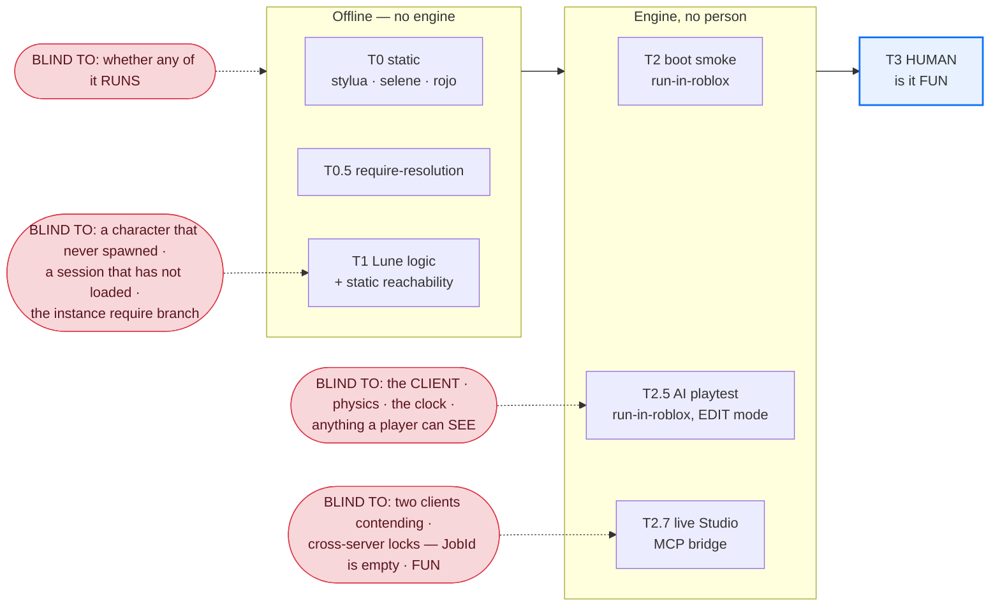

# AI-PLAYTEST-METHOD.md — how an AI verifies a game like a human, or better

The human asked the question this file answers. He playtested `games/collect-sim`, said *"lots and
lots of things are not working"*, and he was right: an 81-agent audit raised 70 findings and
adversarial verifiers — whose default was to refute — **confirmed 66**. At that moment the game had
**361 green Tier-1 tests** and an automated playtest lane reporting **all green**.

That is not a testing gap. It is a **method** gap. This file is the method.

`docs/VERIFICATION-LADDER.md` owns the *ladder* (the rungs, the ordering rule, the handoff guard).
`docs/TESTING.md` owns the *lanes* (the commands, the layout, the runners). **This file owns the
method** — what each rung can and cannot see, which rung should catch which defect, and what is left
for a person.

> **One-line summary.** *Do not assert that a value was written. Assert that the behaviour it
> governs changed.* Everything below is that sentence, made mechanical.

---

## 1. The root pattern

Stated plainly, because it explains 26 of the 66 confirmed defects on its own:

> **A value the player pays for is written to the save file, and the rule that governs play is a
> hardcoded constant sitting right next to it, reading nothing.**

From the real tree, at the time of the playtest:

```
CAPACITY = 50      sat beside   d.upgrades.backpack
ABSORB_RADIUS = 6  sat beside   d.upgrades.magnet
TICK = 0.06        sat beside   d.upgrades["collect-speed"]
"WalkSpeed"        was absent from src/ entirely, while a walk-speed upgrade was on sale
Prisms             granted by rebirth, persisted, shown in the HUD, decremented by nothing
boostExpiresUnix / lastClaimUnix / resetsAtUnix / dayNumber
                   replicated on every change, read by zero client files
```

Maxing all four shop upgrades cost **9,625 Stardust and changed nothing measurable.** Rebirth was a
**pay cut** — it cleared the island flags, so income fell up to 93%, and the Prisms it paid out
bought nothing. Islands 2–5 were freely walkable from minute one, so the unlock sold access the
player already had. The leaderboard was empty in every live server forever, from one line:
`type(player) == "table"` (a real `Player` is `"userdata"`).

### The part that transfers: the tests had the same shape

This is the lesson, not the anecdote. **Every test asserted the WRITE and none asserted the READ.**

- "the level persisted" ✅ · "the balance fell by the cost" ✅ · "the rule changed" — never asked.
- `Mocks.net` never projected `islands` / `restock` / `upgrades` into the `ActionContext`, so every
  seam was tested in **isolation** while the **composition** — a handler consuming a seam through
  `ctx` — was exercised by nothing at all.
- In the automated playtest lane: `affordance-wiring` accepted **any typed `Err`** as a pass, so
  *"island 2 refuses to unlock"* was indistinguishable from working. `traversal` computed a
  `worstDrop` and compared it to nothing. `spawn-safety` raycast downward and hit **the spawn pad
  itself** — it would have passed with every island in the game deleted.
- And the one correct assertion that *did* exist — the one that found the backpack bug and printed
  `capacityBefore: 50, capacityAfter: 50` — was filed into a `knownRed` list emitted **beside** the
  verdict rather than into it. The run published `"ok": true`. *"I found something broken"* and
  *"everything is fine"* were both true of the same run.

### The counter-rule

> **ASSERT THE DELTA.** Capture state `S`. Perform action `A`. Capture `S′`. Assert `S′ − S` is the
> delta the spec promised.

And its four corollaries, each of which is now enforced by code somewhere in the factory:

1. **A return code is not a delta.** `Ok` means the handler replied, not that anything moved.
2. **A registered action is not a delta.** A dispatch count counts calls, not effects.
3. **A module that requires is not a delta.** Resolution is not execution.
4. **"I could not check this" must never serialize as green.** It needs a *third verdict state*
   (`green` / `parked` / `red`), not a second reporting channel. A second channel is exactly what
   the `knownRed` list was.

---

## 2. Blindness is the useful axis

Every rung is green about what it can see. The dangerous property of a rung is **what it is
structurally incapable of observing** — because that is where a defect survives a green run.



*(The ladder itself — the ordering rule and the handoff guard — is the diagram in
`docs/VERIFICATION-LADDER.md` §2. This one is deliberately about blindness, not order.)*

### The blindness table — the load-bearing part of this document

| Rung | Sees | **Cannot see, structurally** | Proof it cannot |
|---|---|---|---|
| **T0** static | formats, lints, that `src/` serializes into a place | whether one line of it executes | `rojo build` **never runs a require**; it serializes a tree |
| **T0.5** require-resolution | that every `require` resolves to a real DataModel target, and that both branches of a D1 shim agree | whether a module *errors at require time*; dynamic requires | a module whose top-level body throws resolves fine |
| **T1** Lune logic | economy math, validators, state machines, migrations — and now **static reachability**: a value written and read by nothing | **a character that never spawned. A session that has not loaded.** The Roblox instance-require branch (`script == nil` is always true under Lune, so the production branch is the dead branch) | the showstopper require bug passed 313 green tests here |
| **T1 reachability** | "written here, read nowhere" as a *class*, offline, in milliseconds | whether the read that exists is a **rule** or a **label** — see §5, defect R3 | measured: one surviving `elseif upgradeId == "magnet"` inside a shop label-preview kept a fully inert upgrade green |
| **T2** boot smoke | the game **boots**; services `Start`; the wire exists; the loop traverses over real `Net.dispatch` | that any of it was built against a non-empty Workspace | this rung ran green for weeks against a Workspace containing **zero parts** |
| **T2.5** AI playtest (edit mode) | measured state deltas from real dispatches, on the real DataModel | **no `LocalPlayer`** (⇒ the entire client, HUD, PlayerGui unreachable) · **physics does not step** (⇒ "is that gap jumpable" is unanswerable) · **the server clock is frozen** (`time()` delta `0.0000` across a real 2s `task.wait`) ⇒ every time-gated feature | all three re-measured every run by the `lane-limits` phase; see `AUTHORING.md` §1 |
| **T2.7** live Studio | real boot, the **real client remote gateway**, real pixels | **two clients contending** · cross-server exclusion (`game.JobId == ""` in Studio, always) · load · a real input device | one session cannot contend with itself |
| **T3** human | **is it fun** | — | — |

Two sentences worth memorising:

> **Nothing under Lune can see a character that has not spawned, a session that has not loaded, or a
> sky.** And **nothing except a screenshot can see that the sky renders no stars.**

---

## 3. Screenshots are an instrument, not decoration

Three of the five defects found in the first live-Studio session were **invisible in every log** and
obvious in a picture. Not "hard to see" — *absent from the logs entirely*, because nothing was
erroring.

1. **The sky rendered no stars.** A `Sky` instance with blank skybox textures renders **nothing** —
   `StarCount` only draws over Roblox's *own* sky, and supplying a blank `Sky` replaces it. Beside
   it, an `Atmosphere` painted a lit haze *below* the horizon: at density `0.36` it washed the frame
   flat blue, and still filled three quarters of it at `0.04`. **The correct configuration was a
   deletion.** Deleting both instances and leaving `ClockTime = 0` gives a full starfield for free.
   *The version with more code in it looked worse.* No log line differs between the two. **A
   screenshot decided this; reasoning did not.**
2. **`AlwaysOnTop` billboards at 110 studs** drew labels from three islands away *over* the ones at
   the player's feet. Every billboard existed, was parented correctly, and had correct text. The
   defect is purely a matter of what overlaps what on screen.
3. **`22 total, 0 visible, 22 parked`.** The world replicated *after* the mote controller started,
   so the first placement pass found no geometry and parked every mote — and the recycle check only
   re-placed motes that had drifted *far*, which a mote parked at the origin never does. A number no
   log flagged, because 22 motes existing is what the server expected to see.

### The protocol that makes a screenshot evidence

An image with no written claim attached is not evidence — **it is a way to feel verified.** So:

1. **State the assertion BEFORE capturing.** In writing, in the artifact.
2. **Capture with a controlled camera**, from a named place (the spawn point, the world's bounding
   box, one shot per playable region). Not "wherever the camera happened to be".
3. **Record a per-image verdict of `pass` / `fail` / `cannot-tell`** — and **`cannot-tell` is not a
   pass.** It is the visual form of "I could not check this", and it is subject to the same rule.
4. An image whose `assertion` string is empty is **dropped from the evidence and pushes its phase
   red**, so a screenshot cannot be added to make a report look thorough.

The six shots the T2.7 pass takes, and the defect each exists to catch:

| shot | camera | catches |
|---|---|---|
| `spawn-eye` | the SpawnLocation, +5 studs, along its facing | frame-1 emptiness; spawning inside geometry |
| `horizon` | same origin, pitched up ~20° | the invisible night sky (defect 1) |
| `overhead` | above the Workspace bounding box, looking down | the world isn't built; regions in the wrong place |
| `zone-<n>` | ground level, one per playable region | the 110-stud billboards (defect 2) |
| `density` | whatever the game spawns dynamically | `22 total, 0 visible` (defect 3), paired with the counted total |
| `hud-play` | **Play mode, default player camera** | the HUD exists at all — nothing else can see PlayerGui |

---

## 4. The economics — the cheapest rung that can catch a bug should catch it

This is the whole reason the ladder is ordered rather than a menu.

| Defect class | Cheapest rung that can catch it | Cost | Evidence |
|---|---|---|---|
| bare cross-service `require` — **the showstopper that shipped** | **T0.5**, static, **no Roblox at all** | milliseconds | it passed 313 green Lune tests, `rojo build`, maker≠checker, adversarial review *and* a convergence sweep; the fix is a token scan |
| a value persisted and read by nothing (**the root pattern**) | **T1 reachability**, static | ~1s over 46 modules | `gate-reachability.luau`, gauntlet stage 5 |
| a currency granted with no sink (Prisms) | **T1 reachability** | same run | rule `currency-sink` |
| `type(player) == "table"` | **T1 reachability** | same run | rule `banned-player-type` — and note the mock that hid it *was the same shape as the bug* |
| a module that resolves but throws at require time | **T2** boot smoke | ~30s | needs a real DataModel |
| a service omitted from the bootstrap (**the T2 smoke building nothing**) | **T2.5** `bootstrap-parity` | ~60s | set-diff against the real entrypoint's `.Source` |
| an upgrade that is bought and changes nothing | **T2.5** `probe:delta` | ~60s | requires a measured before/after, not a reply code |
| a controller that races `loadSession` on join | **T2.7** — the client context | minutes + a live Studio | *no offline rung can see client wiring at all* |
| access computed from an unloaded session | **T2.7** server delta | minutes | `CharacterAdded` fires before `loadSession` returns |
| the sky, the billboards, the invisible motes | **T2.7 screenshots** | minutes | §3 |
| **is it fun** | **T3 — a person** | a person's attention | §6 |

**The rule that follows: exhaust automation first.** The loop must not escalate to a human while a
cheaper automatable rung is red or un-run (`VERIFICATION-LADDER.md` §4.1, enforced mechanically by
`.claude/skills/lib/tier-ladder.luau`). Escalating early spends the scarcest resource in the factory
— human attention — on work a token scan could have done.

The single sharpest data point in this whole document: **the bug that shipped a non-booting game
past every gate was statically catchable with no Roblox at all.** The most expensive failure was
reachable by the cheapest rung.

---

## 5. Doctrine — the five rules, and the machinery that enforces each

These are not aspirations. Each one exists because the factory was burned without it.

| # | Rule | Enforced by | Burned by |
|---|---|---|---|
| 1 | **Fail closed.** A check that could not run is a FAILURE, never a skip and never a silent pass. | gauntlet requires a real summary line, not exit 0; a missing `##T25-EVIDENCE##` sentinel reads red | a main-thread yield made Lune exit 0 *mid-run*, masking every failure after it |
| 2 | **Non-vacuous.** Every gate asserts it found something to check. Zero subjects is a FAIL. | `subjects` counted and emitted numerically per rule and per phase | `spawn-safety` would have passed with every island deleted; the T2 smoke passed against zero parts |
| 3 | **Falsify first.** A gate never observed RED is not known to work. | `playtest-pass.js` returns `T2.5-unfalsified` without a recorded RED per gating phase, against the **same script sha** | three of the T2.5 harness's own first-run results were bugs in the *harness* |
| 4 | **Never claim a tier without an evidence artifact.** Degrade honestly instead. | `tier-status.luau` reads real JSON files; labels say `blocked-on-human`, `T2.7-unrun`, `awaiting-engine-pass` | — |
| 5 | **Assert the delta.** | `probe:delta` calls `read()` on **both** sides itself; `probe:expect` explicitly cannot satisfy a phase | §1, all of it |

### The vacuity traps, named

A gate fails in a characteristic way: it stops finding subjects and keeps reporting green. Watch for
these four shapes specifically.

- **Substring matching on raw source.** A method named `apply`, `get` or `emit` is "referenced"
  by a comment, a docstring or a test name. Fix: blank strings and comments before matching, and
  require the match be *reference-shaped* (`[%.:]name%f[^%w_]`), never a bare substring.
- **Counting calls instead of deltas.** "7 pad dispatches" was counted as 7 proofs. It was one empty
  `Sell` plus six `Err(Insufficient)` refusals against a zero balance — the earn formula was never
  entered once.
- **Threshold relaxation as the failure path.** A gate with numeric thresholds (`server > 10`,
  `checked >= 8`) fails first by having its thresholds lowered to `> 0`, which is vacuity wearing a
  counter. Fix: presence checks with no numbers, plus a **monotonic baseline** — a *drop* in subject
  count is a failure, because 16 seams → 2 is the same lie as zero.
- **A gate aimed at nothing.** Point it at a missing directory, a project file with no mounts, or an
  empty tree, and see whether it reports green. *This one is now proven*: four independent ways of
  aiming `gate-reachability` at nothing all go red, two of them via two mechanisms at once (§7).

---

## 6. What stays human: **fun**

Say it plainly.

> **This entire method exists so that the human playtest can be about fun and nothing else.**

Nothing above decides whether the game is good. A machine can prove that buying an upgrade changes
the number that governs collection speed. It cannot tell you whether the *rate* feels satisfying,
whether 9,625 Stardust is the right price, whether the loop earns a second session, or whether the
sky is beautiful — only that it is not blank.

Legitimately human, by design (`FACTORY.md` §5), and **not** a coverage gap to be closed later:

- **Fun, feel, pacing, and whether the reward curve earns another session.**
- **Aesthetic judgement.** T2.7 can prove the stars render. It cannot prefer them.
- **Real input on a real device** — thumb reach, ProximityPrompt ergonomics, phone UI scaling.
- **Multi-client contention and live exploit traffic.** One Studio session cannot contend with
  itself and `game.JobId` is `""`.
- **The publish decision, and kill-or-scale.**

The measure of this method is not how many rungs are green. It is whether the human's first minute
is spent on *"this doesn't feel good yet"* instead of *"nothing works."* Before the audit, a human
found the top defects **in the first minute.** That minute is the benchmark.

---

## 7. Status — what is proven, and what is UNPROVEN

Doctrine 3 applies to this document too: **a claim never observed to fail is not known to be true.**
Doctrine 6 applies to *this section in particular*: **nothing below is sourced from a builder's
`verified: true`.** Every line comes from an independent checker's recorded run, or from a command
re-run while writing this file. Where a checker is quoted, the quote is verbatim.

**Dated 2026-08-02.** The commands that produced the numbers in this section, all from the repo root:

```
lune run .claude/skills/lib/tests/run.luau                       # 187 checks, 7 FAIL, exit 1
lune run .claude/skills/new-game/tests/run.luau                  # 88 checks, exit 0
cd games/collect-sim && lune run tests/run.luau                  # 416/417, exit 1
cd core && lune run tests/run.luau                               # 105/105, exit 0
lune run .claude/skills/lib/gauntlet.luau games/collect-sim      # exit 1
lune run .claude/skills/lib/gauntlet.luau core                   # exit 0
lune run .claude/skills/lib/tier-status.luau games/collect-sim   # exit 1, highest=T0.5
```

### Proven

**The T1 reachability gate.** Its corpus is green today — `reachability gate: 37 checks`, all passing
(the suite's 7 failures are all in a *different* group; see UNPROVEN row 1).

- **It catches the 9,625-Stardust defect in its EXACT historical form.** The tuning curve kept, still
  compiling, still returning a radius, with only `levelOf(d, "magnet")` swapped for the bare constant.
  As first shipped the rule reported **0 FAIL** on that mutation, because the shop's own effect-*preview*
  dispatcher still said `elseif upgradeId == "magnet"` and any quoted occurrence counted as a read. An
  `==` operand is a UI label branch; it governs nothing. Fixed and falsified both ways; pinned by the
  corpus case `catalog-id-read-only-in-comparison` in
  `.claude/skills/lib/tests/gate_reachability_spec.luau`.
- **It catches the Prisms defect as it ACTUALLY hid.** Deleting collect-sim's only Prism-denominated
  purchase also reported **0 FAIL** at first: the rule asked "does this file name Prisms?" and "can this
  file spend?" as two independent questions, and `UpgradesShopService` answered yes to both — about
  *different currencies*, two hundred lines apart. The spend site must now name the currency it spends.
  Pinned by the corpus case `currency-echoed-but-never-spent`, plus a positive control so the dynamic
  `currencies[entry.currency]` idiom still passes.
- **A seam APPLIED in its own module is read.** R1 first demanded an *other* file and so flagged
  `humanoid.WalkSpeed = UpgradesSeam:walkSpeedFor(d)` — the one upgrade that had previously had no
  implementation at all — as dangling. Flagging correct code is how a gate gets switched off. Relaxed,
  and proven not to have gone blind: stripping the in-module call still goes RED.
- **The name-collision hole is CLOSED, and the closure is what reds collect-sim right now.** This was
  an UNPROVEN row in the previous revision ("three seams publish `multiplierFor`, so any one being live
  marks all three read"). The gate now flags exactly the dead one:

  > `FAIL [seam-read] RebirthService.luau::RebirthSeam.multiplierFor  src/server/services/rebirth/RebirthService.luau:292` —
  > *"`multiplierFor` is published by 3 different seams here, so a bare-name match on it proves nothing
  > about THIS one — that homonym is precisely what used to hide this orphan."*

  The checker falsified it **both ways** on a throwaway copy: as-is → 1 FAIL, exit 1; after adding **one
  real caller** → 0 FAIL, exit 0. Confirmed independently by grep while writing this: the other two
  homonyms are genuinely called (`ctx.islands:multiplierFor`, `ctx.restock:multiplierFor`); the Rebirth
  one has no caller anywhere in `games/collect-sim/src`. **A true positive, not a false alarm.**
- **Its vacuity defence holds.** Four independent ways of aiming the gate at nothing all go RED: an
  emptied catalog (`catalog-ids:0` printed numerically); the entire `src/` tree moved away (**two**
  mechanisms fired at once — per-mount presence *and* the stale-waiver rule); a deleted
  `default.project.json`; and a `gameDir` that does not exist.
- **Orphaning a uniquely-named seam method goes RED**, with the exact `file:line`, the exact
  `Table.method`, and a copy-pasteable waiver subject.

**The scaffolder — the check nobody had run until this review.** `new-game` produces a game that is
green and *honestly labelled*, and the rewritten harness reaches new games:

- 88/88 scaffolder checks, exit 0. A fresh scaffold driven through the real `scaffold.scaffold`:
  gauntlet **exit 0** (stylua · selene · rojo · require · reachability · lune), own suite 105/105.
  Re-run while writing this file: gauntlet exit 0, `tier-status` exit 0.
- `tests/tier2/playtest.server.luau` and `tests/tier2/AUTHORING.md` are **byte-identical** to
  `.claude/skills/lib/templates/tier2/` (`cmp` clean) — the **123,460-byte rewritten harness**, not the
  44,448-byte hand-written collect-sim one. `tests/tier2/phases.json` is derived, 9 rostered phases.
  `tests/verification-allow.json` ships present and **empty**.
- The label is honest, never a plain "verified":
  `highest=T1 | verified-local-T1 (logic only, NOT engine-booted) — T2 blocked-on-human`,
  `t25Evidence:"unrun"`, and reachability prints
  *"not-applicable is NOT a pass — it is 'there is nothing here yet'."*

**The T2.5 harness — seven of nine adversarial attacks are now REFUSED, and the two that remain are narrower than they were.** Each verdict below is the
independent checker's, with its residual stated:

| Attack | Now refused | Checker's evidence, verbatim | Residual |
|---|---|---|---|
| **A3** impostor structural phase (delete `no-log-errors` / `lane-limits` / `bootstrap-parity`, declare an empty one of the same name to inherit `deltasRequired = false`) | **YES** | *"the impostor cannot launder it"* — `run=red phase.ok=true`, `blockers=["the finisher's OWN log scan found 1 error(s) in the Output window: attempt to index nil with 'capacity'"]`. Against the corpus's best catch, the WorldService bootstrap drift in its exact historical form: `blockers = ["the finisher's OWN bootstrap-parity check FAILED: [\"the mirror has WorldService, the entrypoint does not boot it\"]"]` | the impostor phase itself still prints `[PASS]`, so the per-phase summary lies while the verdict does not |
| **A4** live-reference read + `direction = "unchanged"` (a **harness bug**: `probe.delta` projected `expect.field` *after* `act`, so both sides saw post-act state) | **YES** | fixed at the root — `snapshotValue` sanitises the read the instant it is taken. `run=red phase.ok=false`, `100 -> 25 (delta -75, required "unchanged")`, and the aliasing surfaces as a per-phase note `aliased::…`. *"Both halves of the old bug are gone: 'unchanged' no longer passes unconditionally, and 'up' no longer false-reds."* | — |
| **A5** inflated discovery (`probe:subjects(999, …)` with one delta) | **YES** | `subjects` now takes an **identity list**; gating non-structural phases require per-subject coverage. `run=red`, `uncovered=998`, naming them: *"998 of 999 declared subject(s) were NEVER ASSERTED: island-2, island-3, island-4, …"* | see UNPROVEN row 5 — the id list is still author-typed |
| **A6** `blindTo` omitted entirely (documented as "mandatory, and it is checked"; the code read `if spec.blindTo ~= nil then`) | **YES** | explicit phase-level failure: *"blindTo is MANDATORY on every non-structural phase … Name at least one thing this phase cannot see, citing a measured lane limit."* Carried **per phase** into the evidence rather than flattened into one unattributed list | the code's own comment states the honest limit: *"it can force a DECLARATION, never an honest one"* |
| **A7** a roster with ZERO gating phases (`gatingPhasesPassed = #gatingFailed == 0` is vacuously true) | **YES** | `MIN_SPEC_GATING_PHASES = 3` is now a **computed** clause in `finish`: *"only 0 spec-derived gating phase(s) ran (none), needs >= 3. The universal phases prove the HARNESS works; they say nothing about this GAME."* A roster of nothing but the universal phases is refused too | `gatingPhasesPassed` is **still vacuously true in the artifact** — the run reds on the blocker, not on that field |
| **A8** a gating phase declared BELOW the terminal `Harness.finish(ROSTER)` | **YES** | `Harness.phase` prints a **second** sentinel through `redEvidenceLine` and then **throws**, so the misplaced body never runs. `lateDeclThrew=true sentinelLines=2`; the second sentinel decodes `verdict=red`. Two sentinel lines violate the consumer contract ("exactly one, LAST") | the **first** line still says green, and the mechanism depends on a downstream reader refusing a two-sentinel stdout. `t25_harness_loader.sentinelLine` errors on two — correct — but the **JS ingest's** two-line refusal was **not re-verified** |

**The T2.5 harness template is still honestly RED out of the box**, by construction and re-checked
against the rewritten template: `BOOTSTRAP_MIRROR: { string }? = nil` (line 231) is a hard blocker at
three separate sites, and the shipped `example-delta` phase forces `parkedBy = "example-phase-still-present"`
until it is deleted. A fresh fork cannot report green by doing nothing. *(Note the sharp edge the
checker found: this is true of the example while it stays an example. Copied into a gating phase, its
shape is green — §7 row 3(b).)*

**The live-Studio loop itself was driven end to end** and found the five defects in §3 and §4 (commit
`6b5dbee`), including the JoinRetry fix verified RED→GREEN in-engine. That is the *loop*, not the
`engine-pass` skill — see UNPROVEN row 8.

### UNPROVEN — and what would prove it

| # | Claim | Status | What would prove it |
|---|---|---|---|
| 1 | **The factory's own lib suite is green** | **NO — RED right now.** `7 of 187 checks failed`, exit 1. All seven are in one group: `t2.5 harness (the REAL template, loaded)`, and all seven trace to A3's *fix*: `Harness.finish` now re-measures bootstrap parity and re-scans the Output window itself, and neither is satisfiable in the Lune sandbox — *"the finisher could not reach the server mount … ServerScriptService.Server never appeared (15s)"* and *"the finisher's OWN log scan read ZERO lines — a scan that read nothing cannot tell 'clean' from 'never ran'"*. This is **fail-closed working as designed** hitting a fixture that cannot supply the evidence. One failure is louder than the rest: *"MUTANT: deleting that floor from the REAL source flips the SAME phase to ok: mutated phase ok=false — the loader is NOT bound to the template bytes"* | teach `t25_harness_loader` to stub a reachable server mount and a non-empty log, **or** make the loader declare the structural re-measurement unavailable and red the fixture explicitly. Do **not** relax the finisher |
| 2 | **`games/collect-sim` is green** | **NO — RED right now**, and the previous baseline (417/417, gauntlet exit 0) no longer holds: 416/417, gauntlet exit 1, `tier-status` exit 1 with `highestGreen: "T0.5"`, `label: "in-progress (T1 red), NOT ready"`. The one failure is the **true positive** in Proven above, not a regression | delete or wire `RebirthSeam.multiplierFor` (`games/collect-sim/src/server/services/rebirth/RebirthService.luau:292`). A waiver here would be waiving a real orphan |
| 3 | **A1 — the harness refuses a gating phase that touches the game nowhere** | **PARTLY — the forgery is CLOSED, the self-parenting subject is NOT.** The ledger hole is fixed and pinned: a private file-local `MINT` table now stamps only harness-built readers, an author-built `{ channel = "world", read = ... }` is downgraded to `opaque` rather than believed, and `effectiveChannel` may no longer PROMOTE an unminted read to `reply`/`world` — it can only demote and name a `saved` read. So `read = function() Harness.countBaseParts(); return myLocal end` no longer earns game contact. Proven against the REAL template by `t25_forgery_spec` (10 checks), and proven able to fail: re-inserting the promotion branch flips attack A back to `ok=true [world=1]` and reds the spec. **What remains:** a phase may still assert over instances it PARENTED ITSELF, which is the shipped `example-delta`'s shape | forbid a delta whose subject instances were created by the phase body rather than by a dispatch through `Harness.invokeAs` |
| 4 | **A2 — the ROOT PATTERN cannot be laundered through `probe:delta`** | **PARTLY.** The half that rode on the forged channel is closed with row 3 — `probe:governs` can no longer be satisfied by a discarded `countBaseParts()` call, because the governing reader must now be MINTED. **What remains is the aggregate:** the channel rule is still per-PHASE (`reached = channels.reply + channels.world`), not per-delta and not per-subject, so ONE genuine world delta still unlocks every save-only delta in the same phase — *"HARDCODED_CAPACITY is still 50; the saved value is 60"* | make the rule per delta: a `saved` delta needs its own paired `reply`/`world` reader on the SAME subject |
| 5 | **A5 residual — declared subjects are the real subjects** | **NO, and inherently so.** *"declare 1 of the 7 real pads and assert it"* is green: `run=green, 1 subject(s) [1 collection pads]`. *"That is inherent to a harness that cannot enumerate the game"* | nothing fully does. The shipped phases mitigate it by **deriving** ids from discovery (`bootstrapMirror`'s `declaredNames`, `client-load`'s `GetFullName`); the hole is only open where an author hand-types the list. Extend derivation to more phases |
| 6 | **A9 — a hang cannot publish a stale green** | **HALF.** A deadline exists and works (driven directly by substituting the budget to `-1`: *"the run budget is spent: 0.0s elapsed of a -1s budget"*), **but it is read BEFORE each phase and is not a watchdog** — the template says so itself at line 1775. A body that never returns is not interrupted: `run=green bodyRanToCompletion=true`, and the A9 scenario as written still produces **no sentinel line**. And **the reader side is untouched**: `tier-status.luau`'s `readT25` checks **no provenance whatsoever** — no `gitSha`, no `scriptSha256`, no `ranAtUnix` — and does not require the `structuralAssertions` key the template's own comment promises. Confirmed by reading `tier-status.luau` while writing this | a real watchdog needs a scheduler property nobody here has measured — so instead: make the **capture recipe** check `run-in-roblox`'s exit status, and make `readT25` refuse an artifact whose `scriptSha256`/`gitSha` does not match the tree it is being credited to |
| 7 | **`.claude/workflows/playtest-pass.js` behaves as specified** | **UNPROVEN — still never executed.** `node --check` passes (exit 0); that is a parse, not a behaviour. Its two-sentinel refusal (A8's residual) is also unverified | run its §C.8 acceptance cases, especially test 3 (a real green artifact with no falsification file must return `T2.5-unfalsified`), plus a two-sentinel stdout fixture |
| 8 | **`.claude/skills/engine-pass/SKILL.md` works as a skill** | **UNPROVEN, and BLOCKED ON A HUMAN this session.** No `games/collect-sim/tests/engine-pass/` directory exists — no `last-studio.json`, no `screens/`. The T2.7 pass **could not be run**: the Studio bridge answered *"The previously active Studio instance has disconnected"* and the only place listed was `new-game` — **a different project**. The *underlying loop* was proven ad hoc before the skill was written | a human opens `games/collect-sim` in Studio with the MCP plugin; then `/engine-pass games/collect-sim`, **plus** the mandatory falsification run (rename a mounted script → must report `T2.7-unrun (hybrid or unverified place)` and **must not proceed to screenshots**) |
| 9 | **The T2.5 lane is forked into `collect-sim` under the new contract** | **NO.** Verified by listing the directory: `games/collect-sim/tests/tier2/` has a **44,448-byte** hand-written `playtest.server.luau` against the template's **123,460**, and **no `phases.json`, no `last-falsification.json`**. It predates the harness rewrite entirely. (`tests/verification-allow.json` and `tests/tier0/reachability-baseline.json` do exist.) Its `last-playtest.json` still reads `t25Evidence:"green"` in `tier-status` — a green from **the old harness** | run `playtest-pass` in `author` then `falsify` mode against the current template |
| 10 | **A fresh scaffold's zero-coverage window is visible to a machine** | **PARTIAL — improved, not closed.** Reachability on a fresh scaffold prints `coverage:not-applicable · mature:false` and carries `coverage = "not-applicable"` **on the Stage**, so a machine can now see it. But the stage boolean is still `true` and the gauntlet still exits 0 | make the ladder itself treat `coverage == "not-applicable"` as a distinct third state at T1, not a pass — or accept it, documented, because `tier-status` already labels such a game `verified-local-T1 … blocked-on-human` and never `ready` for publish |
| 11 | **Nothing in this repo is committed or pushed** | **TRUE, and the human owns it.** `git status` shows 16 modified and 11 untracked paths against `origin/main` — including `docs/AI-PLAYTEST-METHOD.md` itself, `.claude/skills/lib/gate-reachability.luau`, `.claude/skills/lib/templates/`, and `.claude/workflows/playtest-pass.js`. **No agent in this factory runs a writing git command** | the human runs `git add` / `git commit` / `git push` |

### The honest headline

**Seven of nine adversarial attacks on the T2.5 harness are now refused. The channel ledger is no longer forgeable; what survives is the per-phase aggregate and self-parented subjects.** The harness
fixed the *shape* of the verdict (three states, no author-written boolean, sentinel-last, fallback-red),
closed the `bootstrap-parity` class **at the finisher** where no phase body can reach it, and killed the
aliasing bug outright. It did **not** close the general form of "green while building nothing."

**The structural diagnosis, unchanged and now narrowed to one sentence:** *the harness mandates that **a**
read happen and never asks **what** was read.* The ledger counts a call inside the read window; it never
connects that call to the value returned. Every one of the three surviving attacks (A1, A2, and A2's
`probe:governs` variant) is that single gap wearing a different hat.

---

## 8. The open work, ranked

Recorded here because doctrine 4 forbids quietly carrying an unproven claim forward. None of this is
speculative — each item is a measured miss with a located cause, and each maps to a numbered row in §7.

### What I would do next — cheapest first

**Seven items, and only ONE of them is a design hole.** That is the good result in this section: the
previous revision's P0 list was four design defects; three of those are fixed and falsified, and what
remains is mostly intake and plumbing. The list is short on purpose — nothing speculative is on it.

| # | Do this | Cost | Closes | Why it is first |
|---|---|---|---|---|
| 1 | **Decide `RebirthSeam.multiplierFor`** — delete it or wire it. It is dead: no caller in `games/collect-sim/src`, falsified both ways by the checker (as-is 1 FAIL exit 1; one real caller added → 0 FAIL exit 0) | minutes | §7 row 2 | it is the *only* thing between collect-sim and green, and it is exactly the defect class this whole document is about. **Do not waive it** — a waiver here waives a real orphan and starts the rot §8 warns about below |
| 2 | **Repair the `t25_harness_loader` fixtures** so `finish`'s new self-re-measurement can be satisfied (a reachable stub server mount + a non-empty log), or make the loader red the fixture explicitly as unmeasurable | ~1h | §7 row 1 | the factory's own suite is red, which means *every* future claim about the harness is currently unbacked. Fix the fixture, never the finisher |
| 3 | **Add provenance to `tier-status.luau`'s `readT25`** — require `scriptSha256` / `gitSha` / `ranAtUnix` and the `structuralAssertions` key, and refuse an artifact that does not match the tree being credited | ~1h | §7 row 6 (reader half) | pure reader-side, no engine needed, and it is the half of A9 that a hang actually exploits |
| 4 | **Run `.claude/workflows/playtest-pass.js`'s §C.8 acceptance cases**, plus a two-sentinel-stdout fixture | ~1h | §7 rows 7 and the A8 residual | the file has *never been executed*. It is the component that computes the verdict |
| 5 | **The one design hole: make game-contact per-DELTA and bind the ledger to the returned VALUE.** A `saved` delta must be paired with a `reply`/`world` reader **on the same subject**; a call made during the read window must not mint a channel for a value it did not produce; and a phase must not assert over instances it parented itself | ~1 day | §7 rows 3, 4 | it is the root pattern laundered — the single defect class that cost this factory 26 of 66 confirmed defects. It is fifth only because items 1–4 are hours and this is a day |
| 6 | **Fork the T2.5 lane into `collect-sim` under the current template** (`author` then `falsify`), replacing the 44,448-byte hand-written script | ~1 day | §7 row 9 | worth doing only **after** item 5, or the fork inherits the hole |
| 7 | **Human-owned, and only these two.** (a) The live-Studio T2.7 pass — the bridge reported *"The previously active Studio instance has disconnected"* and the only place listed was `new-game`, a different project, so it could **not** be run this session. (b) `git add` / `git commit` / `git push` — 16 modified and 11 untracked paths, including this file | a person | §7 rows 8, 11 | no agent here runs a writing git command, and one Studio session cannot be conjured by a token scan |

### The standing intake warning — read before item 1

`gate-reachability` is a gauntlet stage, so a true positive reds the *whole* gauntlet. That is correct
and it is the point. But it makes the waiver file the path of least resistance, and **30-day waivers
renewed forever are precisely how allowlists rot into blanket suppression.** `games/collect-sim` carries
three dated waivers today (`schemaVersion`, `stats.joinCount`, `stats.playtimeSeconds` — the last never
written by anything either). Each expires, on purpose, to force the decision rather than bury it. When
they come due, the answer must be *fix* or *drop the field* — not *renew*.

---

## 9. Reading order

- **The ladder, the rungs, the ordering rule, the handoff guard** → `docs/VERIFICATION-LADDER.md`
- **The lanes and the exact commands** → `docs/TESTING.md` §10
- **Authoring a T2.5 phase** → `.claude/skills/lib/templates/tier2/AUTHORING.md`
- **Driving a live Studio session** → `.claude/skills/engine-pass/SKILL.md`
- **The failure modes to read before building** → `docs/LEARNINGS.md`
- **Measured engine facts, per game** → `games/<slug>/tests/tier2/ENGINE-FACTS.md`
