# CORE-STRUCTURE.md — the `core/` spine, in pictures

The **visual** companion to `docs/CORE-DESIGN.md`. That file owns the *rationale* (every module's
contract, why the shape is what it is). This file owns the *map*: the file tree, the Rojo → Roblox
mapping, the dependency-injection graph, and the three runtime flows (net, data, boot) drawn as
diagrams faithful to the committed spine.

> **View this on GitHub** (or any Mermaid-aware viewer) to see the diagrams rendered — the diagrams
> carry the load here, the prose is deliberately thin.

**Cross-links:** `ARCHITECTURE.md` owns the *planned* repo layout and verification tiers ·
`docs/CORE-DESIGN.md` owns the *textual* design rationale and the per-module API contract ·
`docs/TESTING.md` owns *how we test*.

Status legend (same as CORE-DESIGN.md): **[SPINE]** built now · **[B2]** deferred, contract
accounted for · **[SAMPLE]** deletable per game (proves the wiring).

---

## 1. The annotated file tree

`tests/` and `lune/` are Lune tooling and are **not** mounted into the Roblox DataModel by
`default.project.json` — only `src/{shared,server,client}` are.

```
core/
|-- default.project.json      # Rojo: maps src/{shared,server,client} into the DataModel
|-- .luaurc                   # strict Luau + path aliases (shared/server/client)
|-- selene.toml               # lint config: std = roblox-fenced
|-- roblox-fenced.yml         # selene std overlay: wait/spawn/delay marked removed
|-- stylua.toml               # formatter: Luau, tabs, 100-col, prefer-double quotes
|-- wally.toml                # package factory/core 0.1.0; deliberately zero deps
|-- lune/.gitkeep             # placeholder dir (Lune build/tooling scripts)
|
|-- src/
|   |-- shared/               # -> ReplicatedStorage.Shared (server+client contracts)
|   |   |-- init.luau         # barrel: re-exports Result/Types/Net/Config/Migrations
|   |   |-- Result.luau       # Ok/Err Result type + stable Result.Codes (leaf)
|   |   |-- Types.luau        # PlayerData + PlayerView + pure toView allowlist (leaf)
|   |   |-- Net.luau          # action Registry + the ONE pure Net.dispatch pipeline
|   |   |-- Config.luau       # static tunables + clientSubset projection (leaf)
|   |   `-- Migrations.luau   # default() + migrate() pure steps (requires ./Types)
|   |
|   |-- server/              # -> ServerScriptService.Server (init.server -> Script)
|   |   |-- init.server.luau  # THE server bootstrap; only place knowing service order
|   |   |-- Context.luau      # Context.build news up clock/config/data/net/gate
|   |   |-- framework/
|   |   |   |-- Service.luau   # Service type + define() identity helper (leaf)
|   |   |   `-- Bootstrap.luau # pure start(order)/stop(reverse) sequencer
|   |   |-- net/
|   |   |   `-- NetServer.luau # binds CoreGateway RF + CoreEvents RE; register/dispatch
|   |   |-- security/
|   |   |   `-- Gate.luau      # token-bucket check() + assertOwner() (injected clock)
|   |   |-- data/
|   |   |   |-- init.luau       # data barrel (Store/MockStore/Clock/DataService)
|   |   |   |-- Store.luau      # low-level Store + Session INTERFACE types
|   |   |   |-- MockStore.luau  # in-memory Store impl + FIFO lock queue (runtime default)
|   |   |   |-- Clock.luau      # Clock.real/.fake; unix (persist) vs mono (rate)
|   |   |   `-- DataService.luau# per-player session lifecycle: get/update/save + Start/Stop
|   |   `-- services/
|   |       `-- sample/         # [SAMPLE] deletable per new-game
|   |           |-- SampleService.luau # Start() registers the sample action
|   |           `-- SampleAction.luau  # sample.ping action: validate + handler
|   |
|   `-- client/              # -> StarterPlayer.StarterPlayerScripts.Client (init.client -> LocalScript)
|       |-- init.client.luau  # THE client bootstrap; controller order
|       |-- Context.luau      # builds NetClient + client-safe config subset
|       |-- framework/
|       |   |-- Controller.luau# Controller type + define() helper (client mirror of Service)
|       |   `-- Bootstrap.luau # duplicate of server Bootstrap (no cross-tree require)
|       |-- net/
|       |   `-- NetClient.luau # call() over CoreGateway RF, on() over CoreEvents RE
|       `-- controllers/
|           `-- sample/        # [SAMPLE] deletable
|               `-- SampleController.luau # fires sample.ping once; subscribes to data view
|
`-- tests/                    # Lune Tier-1 suite (not mounted into the DataModel)
    |-- run.luau              # runner: explicit sorted SPEC_PATHS; one JSON line out
    |-- lib/
    |   |-- assert.luau        # pure assertion primitives
    |   |-- testkit.luau       # describe/it/expect + JSON reporter
    |   `-- mocks.luau         # Tier-1 fakes requiring the REAL source modules
    `-- unit/
        |-- clock.spec.luau
        |-- data.spec.luau
        |-- economy_race.spec.luau
        |-- framework.spec.luau
        |-- migration.spec.luau
        |-- net.spec.luau
        |-- sample.spec.luau
        |-- validation.spec.luau
        `-- selene_guard.spec.luau
```

---

## 2. Rojo → Roblox: filesystem roots and the suffix convention

`default.project.json` mounts **exactly three** filesystem roots into the DataModel via `$path`.
There is no `Packages` node until wally introduces a first dependency.

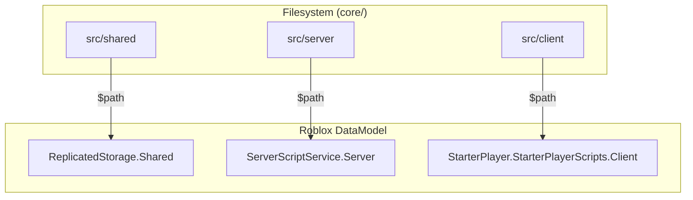

The Rojo file-suffix rules, as actually used in this tree: `init.server.luau` makes its folder a
server `Script`; `init.client.luau` makes its folder a `LocalScript`; an `init.luau` makes its
**folder** a `ModuleScript` with siblings as children; any other `*.luau` is a plain `ModuleScript`.

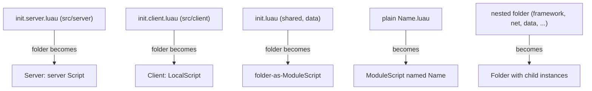

---

## 3. Module layering & dependency injection

Require edges only ever point **downward** into the shared leaves; siblings never require each other.
The single composition root `Context.build` is the **only** module that requires the concrete
`data`/`net`/`gate` implementations — so collaborators are constructed once and passed by argument,
and no load-order cycle is possible.

**Lune-clean vs Roblox-only:** every shared module plus all of `data/*`, `security/Gate`,
`framework/*`, and `services/sample/*` are *Lune-clean* — they touch no Roblox global, so a Tier-1
spec can require and exercise them directly. Only `Context.luau`, `net/NetServer.luau`,
`init.server.luau` (and the barrel `init.luau` files, which run only at Roblox runtime) are
*Roblox-only* — they use `game`/`script`/`Instance` and are never required by a spec.

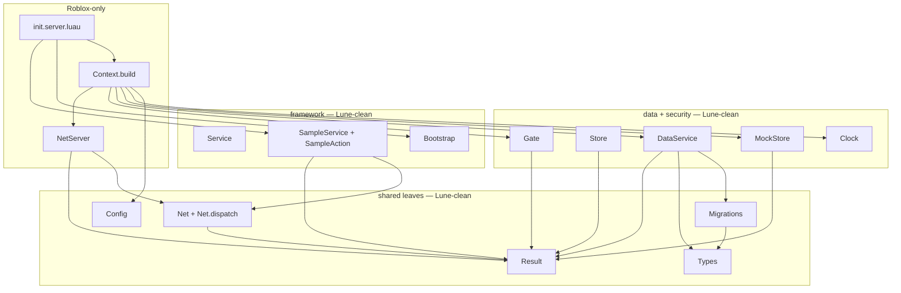

Construct-then-inject order inside `Context.build`: every collaborator is built once and handed to
the next by argument (clock into store/data/gate, store/clock/config into data, gate into net). The
deps are the **same** object references later placed in the context table and Started in order.

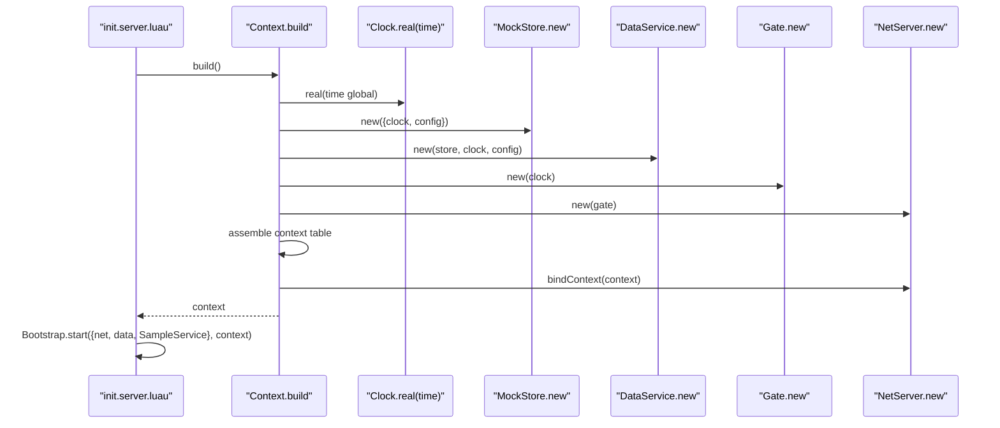

Handlers receive collaborators through the narrow `ActionContext` that `NetServer` closes over from
the full context; services register via `context.net` and read deps via `ctx` — so feature code
never requires `NetServer`, `Gate`, or `DataService` directly.

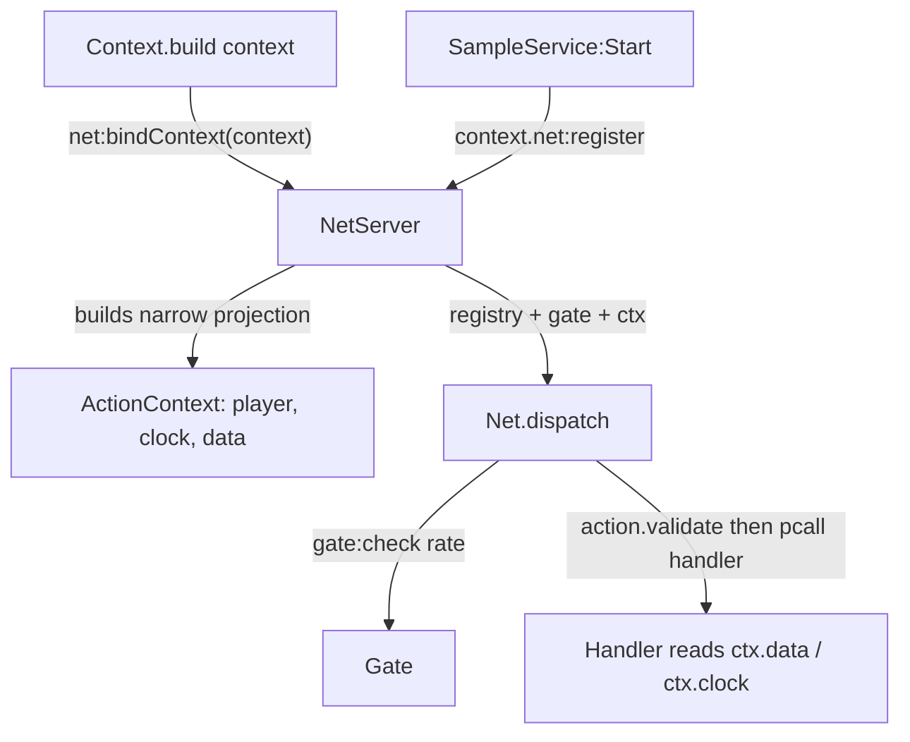

---

## 4. The Net request lifecycle (server authority)

The entire wire surface is **one** `RemoteFunction` (`CoreGateway`) plus one `RemoteEvent`
(`CoreEvents`), both parented to `ReplicatedStorage`. Every inbound client action funnels through the
single RemoteFunction into `Net.dispatch`, the one pure pipeline shared by the real wire and the test
mocks so they cannot diverge.

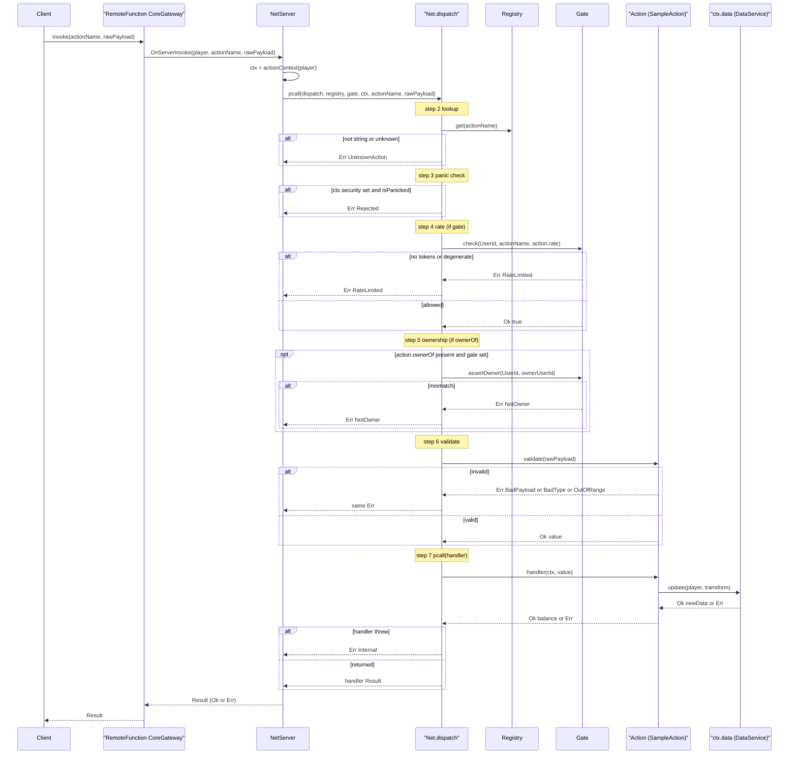

Each guard short-circuits to a specific `Result.Code` in code order; only after lookup, panic, rate,
ownership, and validate all pass does step 7 `pcall` the handler. A double `pcall` (outer in
`NetServer`, inner in dispatch step 7) means **no** thrown error ever crosses the wire — it becomes
`Err Internal`. The rate policy and ownership predicate come from the registered Action, never the
client payload.

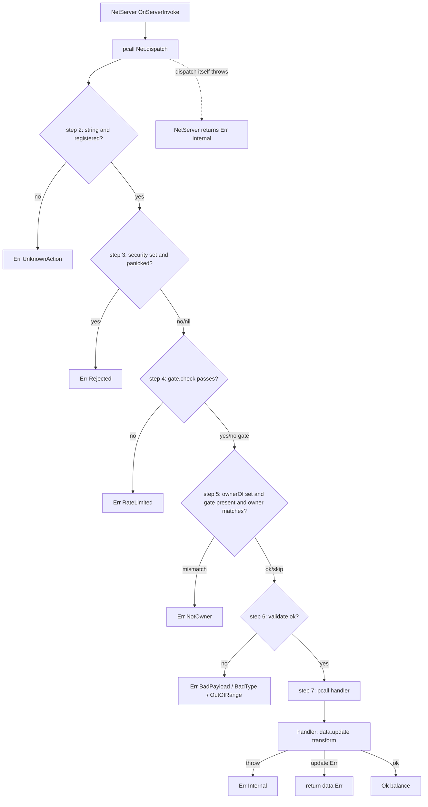

---

## 5. The data layer

`DataService.update(player, transform)` is **the** canonical write path; it delegates to the Store
session, which enforces a per-key FIFO lock queue. A second same-key update **parks and yields
without reading**, so it only re-reads the fresh post-write snapshot *after* the lock is handed to
it — which is exactly what makes `0+5` then `5+3 = 8` exact, never a lost update. (`MockStore`'s
`deepCopy`-on-read is what makes the race real and the falsifiability test pass.)

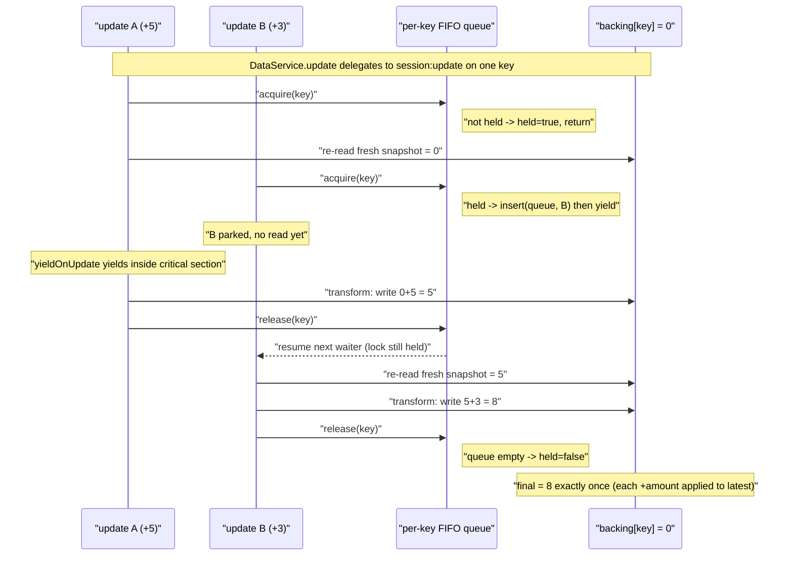

`save()` can fail via `failSave`, the `throttleSaves` counter, or the `writeMinIntervalSeconds` floor
(measured on `clock:mono`). `saveSession` retries up to `maxRetries`, advancing the **injected** clock
between attempts so the throttle floor clears without yielding; on budget exhaustion it **surfaces**
the `Err` with a data-loss-risk warn rather than swallowing it. `Stop` (BindToClose) releases the
lock regardless so a restart can re-acquire.

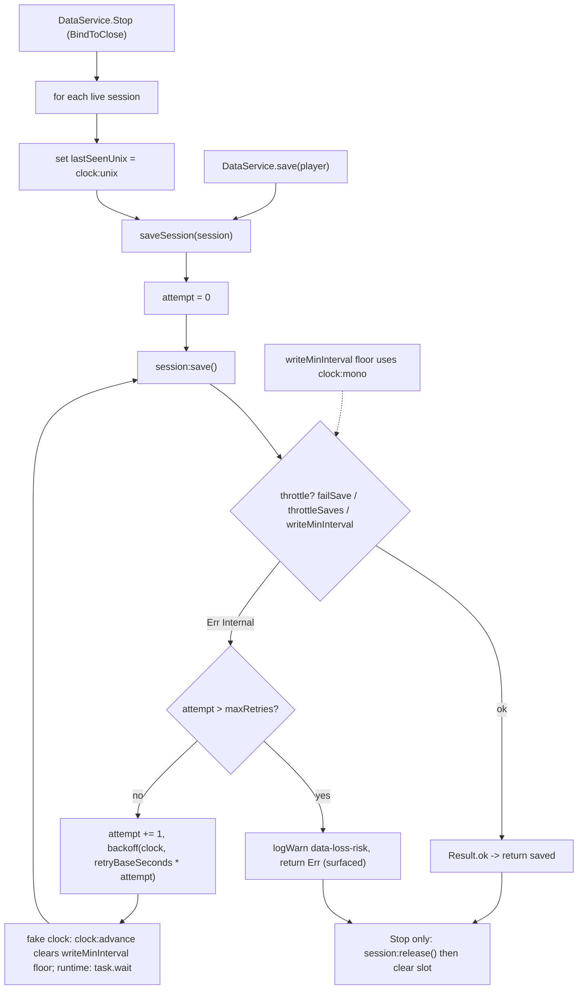

---

## 6. Bootstrap order & the test harness

Two-phase deterministic boot: `Context.build` constructs every field (no I/O) and wires `net` via
`bindContext`, then `Bootstrap.start` runs `Start` in the **fixed** order `net → data →
SampleService`. `BindToClose` drives `Bootstrap.stop` in **reverse** so `DataService.Stop` flushes
every session; a failing `Start` raises loudly, a failing `Stop` only warns.

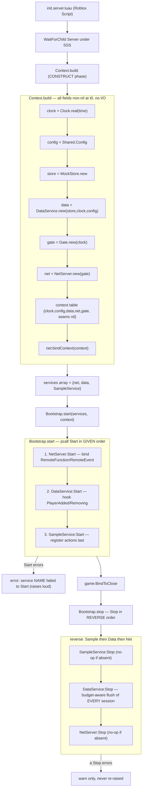

The **gauntlet** is the four-step self-check contract (documented in `docs/TESTING.md` §2 and
`docs/CORE-DESIGN.md` §9 — it is a contract, not a committed script): `stylua --check`, then `selene`
under the `roblox-fenced` overlay that turns `wait`/`spawn`/`delay` into errors, then `rojo build`
(the only gate proving the Roblox-only modules compile), then `lune run tests/run.luau`, which prints
exactly one JSON line and exits nonzero on any failure.

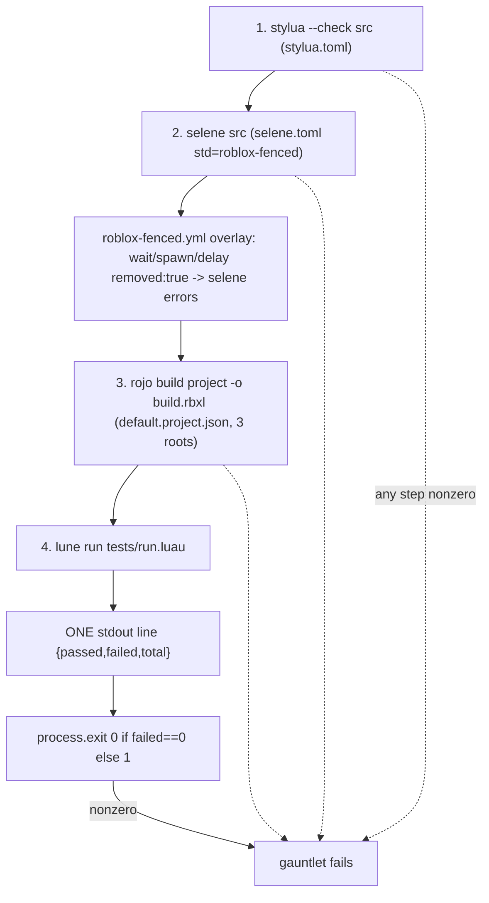

Inside step 4, `run.luau` requires the shared `testkit`, iterates the explicit lexically-sorted
`SPEC_PATHS` with `pcall(require)` (load errors become recorded failures), runs every registered case
via `testkit.run()`, routes failure detail to STDERR, and prints exactly one JSON line to STDOUT.

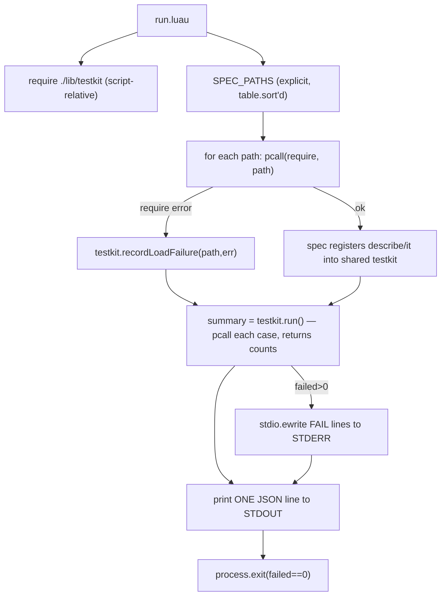

The on-disk `tests/` layout — the runner, three lib helpers, and the nine unit specs that match the
nine `SPEC_PATHS` entries:

```
core/tests/
  run.luau                 runner: explicit SPEC_PATHS, prints ONE JSON line, exits nonzero on fail
  lib/
    testkit.luau           describe/it/expect + JSON reporter data source (run() returns counts)
    assert.luau            deepEqual/isResultOk/isResultErr/approx/fail/render (no Roblox globals)
    mocks.luau             mock store + Mocks.logWarn stderr writer (keeps JSON line clean)
  unit/
    clock.spec.luau
    data.spec.luau
    economy_race.spec.luau
    framework.spec.luau
    migration.spec.luau
    net.spec.luau
    sample.spec.luau
    validation.spec.luau
    selene_guard.spec.luau  structural + best-effort live overlay self-test
```
