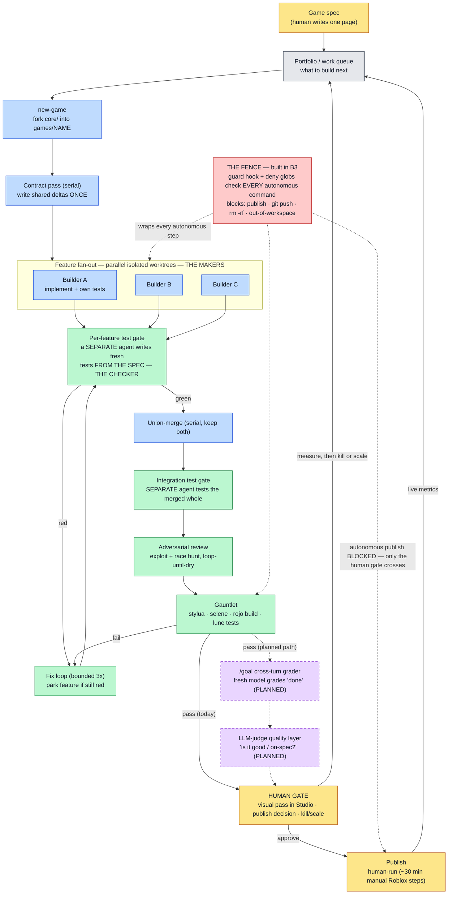

# FACTORY-LOOP.md — the whole factory as one picture

The **macro** view: the entire factory drawn as a single self-feeding control loop — a spec goes
in the top, a verified game comes out, and the funnel feeds the next build. `FACTORY.md` owns the
*policy* (the autonomy model, the fence, the gates, the lifecycle in §8); this file owns the *one
diagram that shows all of it interacting at once*, and reads it in plain language.

> **View this on GitHub** (or any Mermaid-aware viewer) to see the diagram rendered live. A static
> render is committed at `docs/diagrams/factory-loop.png` (and `.svg`) for everywhere else.

**Cross-links:** `FACTORY.md` §8 owns the *textual* lifecycle · `ARCHITECTURE.md` owns the build
pipeline + verification tiers · `docs/CORE-STRUCTURE.md` owns the *micro* view (how one **running
game** handles a request / saves data / boots) · `docs/LOOP-ENGINEERING.md` owns *why the loop is
shaped this way* and the upgrade roadmap · `docs/FENCE.md` owns the red box.

This is the **macro** loop (how a game gets *built*); `CORE-STRUCTURE.md` is the **micro** loop (how
a built game *runs*). Different altitudes of the same system.

---

## 1. The loop

## 2. The five colors

| Color | Meaning | Who |
|---|---|---|
| 🟡 **Yellow** | **Human** — the only three places a person is required | you write the spec; you make the visual/publish/kill-or-scale call; you run publish |
| 🔵 **Blue** | **Makers** — agents that *build* | scaffold, contract pass, the parallel builders, the merge |
| 🟢 **Green** | **Checkers** — agents/tools that *validate* | the two test gates, the adversarial review, the gauntlet |
| 🟣 **Purple (dashed)** | **Planned** — validators not yet built | `/goal` cross-turn grader, LLM-judge quality layer |
| 🔴 **Red** | **The fence** — the B3 safety clamp | guard hook + deny globs |

## 3. Reading the loop

1. **You write a one-page spec** (top) → it lands in the **portfolio work queue**.
2. **`new-game`** forks the `core/` foundation into `games/NAME`; the **contract pass** writes the
   shared wiring (action registry + data shape) *once, serially*, so parallel work can't collide.
3. **Feature fan-out** — several **builders** work at once, each in its own isolated git worktree,
   each implementing one feature plus its own tests.
4. Each feature hits a **per-feature test gate** — *a separate agent that authors fresh tests from
   the spec.* The builder never grades its own work. Green → forward; red → **fix loop** (bounded;
   a feature that won't go green is **parked**, never merged, and the run continues on the rest).
5. Merge-ready branches **union-merge** serially → the **integration test gate** tests the combined
   game → the **adversarial review** hunts exploits and races *until it comes up dry* → the
   **gauntlet** (stylua · selene · rojo build · lune tests) is the deterministic wall.
6. Pass → **human gate**: you do the visual pass in Studio and make the publish / kill-or-scale
   call → **publish** is human-run. Live metrics flow back to the **queue** → the next build.

## 4. The three invariants the picture makes visible

1. **Green is never blue.** The checker is always a *different* agent from the maker — the
   maker/checker split, drawn as colors that never merge. (FACTORY.md §3.)
2. **The red fence wraps every autonomous step** and blocks the autonomous shortcut to Publish. The
   *only* path from the green build region to the yellow Publish box runs **through the human
   gate** — the factory cannot publish itself. (FACTORY.md §4, `docs/FENCE.md`.)
3. **The two dashed-purple boxes are how the loop closes.** Today the gauntlet passes and the
   orchestrator declares "done" (the solid `pass (today)` arrow). The planned path routes through
   `/goal` (a *fresh* model grading the written done-condition) and the LLM-judge ("is it *good* /
   on-spec?") first. Those boxes turning solid is what makes the loop grade *itself* instead of
   trusting the worker. (`docs/LOOP-ENGINEERING.md` §4, upgrades 3–4.)

## 5. Built vs. planned (honest status)

- **Solid and real today:** the `core/` foundation (Phase B1), the gauntlet, and the red fence
  (Phase B3, live and gate-zero-verified).
- **Doctrine, not code yet:** the blue/green build-and-verify *pipeline* (the fan-out, the two
  gates, the merge, the adversarial pass) is Phase **B4**; the top **work-queue → auto-start**
  arrow and both purple **graders** are the loop-engineering upgrades that follow it.

Keep this diagram in sync with `FACTORY.md` §8 and `docs/LOOP-ENGINEERING.md` §4 — if the lifecycle
or the upgrade status changes, re-render from the Mermaid source above (the committed PNG/SVG in
`docs/diagrams/` are generated, not hand-drawn).
