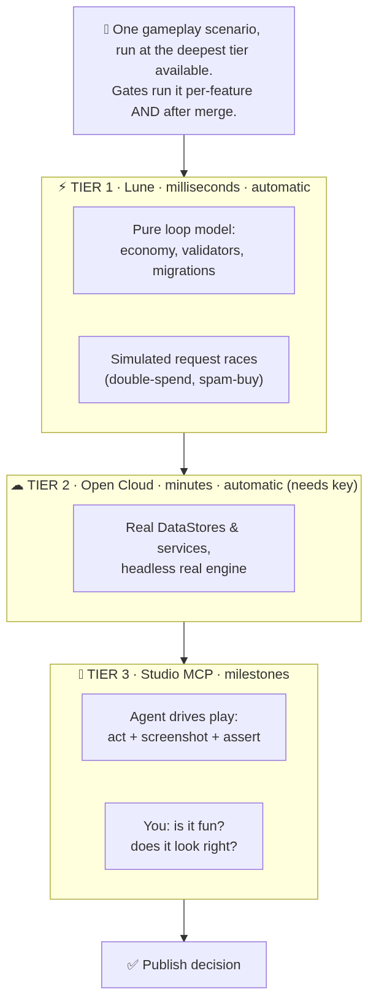

# TESTING.md — how Claude Code tests the game

The testing contract for the factory. `FACTORY.md` owns *when* testing happens (the gates);
`ARCHITECTURE.md` owns *where* it sits in the pipeline; **this file owns *how*** — the tiers, the
tools, what is and isn't catchable automatically, and how the test agent actually works. The harness
that implements all of this is built in Phase B; this document is what it builds to.



## 1. Principles

- **Independent verification.** The agent that wrote a feature does not get the final say on whether
  it works. A separate **test agent** writes tests **from the spec**, not from the implementation.
- **Test at the smallest scope, every step.** Per feature (before merge) and on the merged whole
  (after merge). Small scope = a failure points at one feature, not a haystack.
- **Design for testability.** Game logic is written **pure and injectable** — the economy math, the
  validators, the migration functions take plain inputs and return plain outputs, with Roblox
  services passed in (not `require`d globally). Pure logic is what Tier 1 can test in milliseconds.
- **Machine-readable results.** Test runs print **one JSON line** of `{passed, failed, total, …}` so
  both local tooling and cloud logs can parse pass/fail deterministically.
- **Regression is non-negotiable.** Every test that was green stays green; a new feature that turns an
  old test red is not done.

## 2. The gauntlet — the fast self-check (every agent, every change)

The local loop every builder and the test agent must get green before anything advances:

```
stylua --check src        # formatting
selene src                # lint / banned APIs (wait()/spawn(), etc.)
rojo build <project> -o build.rbxl   # it actually compiles into a place
lune run tests/run.luau   # Tier-1 unit tests → prints one JSON summary line
```

A PostToolUse hook runs StyLua + Selene on each edited file automatically and feeds failures back, so
formatting/lint self-corrects in the same turn (see `ARCHITECTURE.md` → Safety hooks).

## 3. The three tiers — and what each can (and can't) test

| Tier | Tool | Speed | Real engine? | Runs |
|---|---|---|---|---|
| **1 · Logic** | **Lune** (standalone Luau) | milliseconds | ❌ no DataModel/network | every change, every gate |
| **2 · Engine truth** | **Open Cloud Luau Execution** | minutes | ✅ real DataModel + DataStores, headless | CI, once an API key exists |
| **3 · Gameplay** | **Roblox Studio** (+ multi-client test) | seconds–minutes, manual | ✅ full engine + players + physics | human visual/publish gate |

**Coverage matrix — be honest about what lives where:**

| What we're checking | Tier 1 | Tier 2 | Tier 3 |
|---|---|---|---|
| Economy math, validators, state machines, data transforms | ✅ | ✅ | — |
| DataStore migration round-trips (pure functions) | ✅ | ✅ | — |
| Rate-limit / payload-validation logic | ✅ | — | — |
| **Single-server** race / interleaving (double-spend, spam-buy) | ✅ *simulated* | ✅ | ✅ |
| Real DataStore persistence, BindToClose saves, service wiring | ❌ | ✅ | ✅ |
| **Multi-client replication** races, exploit traffic | ❌ | partial | ✅ |
| Visuals, UI sizing across phones, lighting, "feel" | ❌ | ❌ | ✅ human |
| Mobile performance / memory budgets | ❌ | ❌ | ✅ human |

> The big takeaway: **most logic and economy bugs are caught for free in Tier 1**, the engine-truth
> stuff needs the key (Tier 2), and a real human still has to look at how it plays and feels (Tier 3).

## 4. The test agent

A specialized agent whose only job is to verify — it never writes the feature it tests.

- **Input:** the feature's slice of the spec + the shared contracts (`src/shared`). It works from
  *intended* behavior, deliberately not trusting the implementation in front of it.
- **Output:** new Tier-1 tests authored as code under `tests/`, a run of the full gauntlet, and a
  verdict (`green` / failing cases). It also flags anything only checkable at Tier 2/3.
- **Fix loop:** on failure, the failing cases go back to a fixer (the builder); the test agent
  re-verifies. Bounded (default 3 rounds).
- **Parking:** a feature that still won't go green is **parked** on its branch for human review —
  never merged. The run continues on everything else.

## 5. The two gates

```
build feature (+ its own tests)
   └─> PER-FEATURE GATE   test agent writes fresh tests from spec → gauntlet → fix-loop → merge-ready?
                          (only green features get merged)
union-merge merge-ready branches (staggered, one at a time, re-verify each)
   └─> INTEGRATION GATE   test agent tests the MERGED whole: cross-feature interactions
                          (e.g. buying in Shop updates Offline multiplier) + full regression
   └─> ADVERSARIAL PASS   exploit + race-condition hunt (economy dupes, double-spend), loop-until-dry
```

## 6. Gameplay scenario tests

A gameplay scenario is the **intended player experience written once as a Pass/Fail script**, then
verified as deeply as the current setup allows. You author *what should happen*; the factory runs the
same scenario at every tier it can.

**Format (Given / When / Then):**

```
SCENARIO: first-sell-and-upgrade
  GIVEN  a new player on Island 1
  WHEN   they collect to a full backpack and sell at the refiner
  THEN   Stardust increases by (backpack size × island-1 mote value)
  WHEN   they buy "Collect Speed I"
  THEN   the purchase succeeds, Stardust is debited exactly once, collect rate increases
  WHEN   they rebirth at the threshold
  THEN   Prisms are granted, the multiplier applies, Stardust resets to 0
```

**Run-at-deepest-tier — one scenario, three depths:**

| Tier | How the scenario runs | What it proves |
|---|---|---|
| **1 · Lune** | drive the pure loop model through the scenario's steps | the *rules* are right (math, debit-once, reset) — instant, every change |
| **2 · Open Cloud** | fire the real server actions in a headless engine; assert state + DataStore | the *engine wiring* is right (real persistence, real services) |
| **3 · Studio MCP** | an agent runs it as a live playtest (below) + screenshots | it *actually plays* — and doubles as your manual feel-check list |

You write gameplay intent once; it's verified at the deepest tier available (Tier 1 always; Tier 2
when the key exists; Tier 3 at milestones). Scenarios live in `tests/scenarios/` and are consumed by
both the Tier-1 and Tier-2 runners.

### Tier-3 — agent-driven Studio playtest (MCP now installed)

Launch:
1. `rojo build games/<name>/default.project.json -o build.rbxl` (or `rojo serve` + the Rojo plugin),
   open it in **Roblox Studio**, and start a new Claude Code session.
2. Studio prompts to **allow the MCP connection** — approve it.
3. The agent now has: `start_stop_play`, `execute_luau`, `character_navigation`, `screen_capture`, console.

**The golden rule — act semantically, verify with screenshots:**
- **Act** by calling the real logic — `execute_luau` to fire the `shop.buy` action, `character_navigation`
  to walk to the refiner. Deterministic and resolution-proof.
- **Verify** by reading state (console / `execute_luau` return values) **and** a `screen_capture`
  ("does the HUD show the new balance? did the shop panel open?").
- **Avoid blind pixel-clicking** — it's brittle (AI aims poorly; UI shifts with resolution). Use it
  only when there is genuinely no semantic hook.
- True multi-client replication / exploit traffic → Studio **multi-client test mode**.

Tier 3 is slower and has **usage caps**, so it runs at **milestones / pre-publish**, not every edit.
What it can't decide — *is it fun, does it look right* — stays your call (§9).

## 7. Roblox-specific testing concerns

- **Server authority.** Every client→server action gets negative tests: malformed payload, wrong
  type/range, not-the-owner, over-rate. The client is assumed hostile.
- **Economy anti-dupe / anti-mint.** Tests assert currency can't be minted (grants ≤ cap), can't
  overflow, can't go negative, and survives **interleaved/duplicated requests** (the spam-click dupe).
- **Race conditions, simulated in Tier 1.** Luau is single-threaded with cooperative yields, so many
  "races" are really *async-ordering* bugs (a second request lands while the first is mid-`await`).
  The test agent reproduces these by driving the pure handler with **interleaved calls against a mock
  store that yields**, asserting the final balance is correct exactly once. True *multi-client*
  replication races escalate to Tier 3 (Studio multi-client test mode).
- **Data migrations.** Every structural change to the player-data shape ships a migration; tests feed
  an old-version blob through it and assert a valid new-version blob (round-trip, no data loss).
- **Idempotent purchases.** Tests replay the same receipt twice and assert the grant happens **exactly
  once** (no dupe, no loss) — the `ProcessReceipt` correctness check, with real money on the line.
- **Injectable clock.** Time-based features (offline earnings, streaks, restock) are tested by advancing
  a **fake server clock**; tests assert correct accrual *and* that **client-supplied time is ignored**
  (the clock-rollback exploit).
- **DataStore budgets.** Tests assert same-key writes are throttled/retried rather than fired blindly,
  so saves don't silently fail under load.
- **Mocking Roblox services.** Tier 1 uses a **mock DataStore** (and other fakes) so persistence
  logic runs with no live Roblox connection. Real DataStores are exercised in Tier 2.

## 8. Test layout & how to run

```
tests/
  run.luau              # the runner — discovers specs, runs them, prints ONE JSON summary line
  lib/
    testkit.luau        # describe/it/expect + the JSON reporter
    assert.luau         # assertions
    mocks.luau          # mock DataStore + service fakes for Tier 1
  unit/
    <feature>.spec.luau # one spec file per feature (economy, shop, rebirth, offline, …)
  scenarios/
    <name>.scenario.luau # Given/When/Then gameplay scenarios (run at Tier 1 & 2 — §6)
  engine/
    <suite>.server.luau # Tier-2 in-engine suites (run via Open Cloud); print one JSON line too
```

Run locally (Tier 1):
```
lune run tests/run.luau
```
Run engine truth (Tier 2, once a key exists — headless lane, kept cheap):
```
lune run lune/cloud-test.luau     # build → publish to TEST place → Luau Execution → poll logs
```
Tier 3 is manual: open the place in Studio, Play / multi-client test, eyeball visuals.

## 9. What we deliberately do NOT pretend to auto-test

Visual layout, lighting, UI scaling across devices, animation/"juice", overall fun, and true
multi-client replication under load. These route to the **human gate** (`FACTORY.md` §5) — the factory
greyboxes and hands off; you make the call. Claiming a green test suite means "the game is good" would
be dishonest: it means **the logic is correct**, which is necessary but not sufficient.
