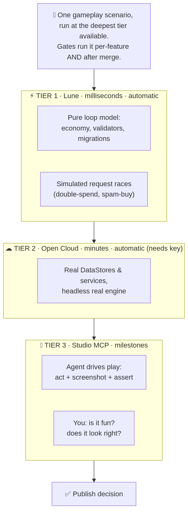

# TESTING.md — how Claude Code tests the game

The testing contract for the factory. `FACTORY.md` owns *when* testing happens (the gates);
`ARCHITECTURE.md` owns *where* it sits in the pipeline; **this file owns *how*** — the tiers, the
tools, what is and isn't catchable automatically, and how the test agent actually works. The harness
that implements all of this is built in Phase B; this document is what it builds to.



## 1. Principles

- **Independent verification.** The agent that wrote a feature does not get the final say on whether
  it works. A separate **test agent** writes tests **from the spec**, not from the implementation.
- **Test at the smallest scope, every step.** Per feature (before merge) and on the merged whole
  (after merge). Small scope = a failure points at one feature, not a haystack.
- **Design for testability.** Game logic is written **pure and injectable** — the economy math, the
  validators, the migration functions take plain inputs and return plain outputs, with Roblox
  services passed in (not `require`d globally). Pure logic is what Tier 1 can test in milliseconds.
- **Machine-readable results.** Test runs print **one JSON line** of `{passed, failed, total, …}` so
  both local tooling and cloud logs can parse pass/fail deterministically.
- **Regression is non-negotiable.** Every test that was green stays green; a new feature that turns an
  old test red is not done.

## 2. The gauntlet — the fast self-check (every agent, every change)

The local loop every builder and the test agent must get green before anything advances:

```
stylua --check src        # formatting
selene src                # lint / banned APIs (wait()/spawn()/delay() — see note below)
rojo build <project> -o build.rbxl   # it actually compiles into a place
gate-require              # T0.5 — every require resolves in the DataModel, not just the filesystem
gate-reachability         # T1  — nothing is WRITTEN here and READ nowhere  (§10.1)
lune run tests/run.luau   # Tier-1 unit tests → prints one JSON summary line
```

Six stages, in that order. Run the whole thing for one game with:

```
lune run .claude/skills/lib/gauntlet.luau games/<slug>     # one JSON line: {ok, gameDir, stages}
```

`gate-reachability` is ordered **before** the Lune stage deliberately: it is the cheapest gate that can
see the root pattern (§10.1), so it should fail fast and specifically rather than after a full suite.

> **Banned-API enforcement note (verified on the pinned selene 0.31.0).** Stock `std = "roblox"` does
> **not** flag `wait()`/`spawn()`/`delay()` — it loads the roblox std (it correctly flags undefined
> globals) but those three are defined and not deprecated, so they pass clean. The core therefore
> ships a **custom std overlay** (`core/roblox-fenced.yml` — beside `core/selene.toml`; filename must
> equal the std name; `base: roblox` with `wait`/`spawn`/`delay` marked `removed: true`, referenced as
> `std = "roblox-fenced"`); under it those calls are selene
> **errors** (nonzero exit), while `task.*` is clean. A Tier-1 self-test asserts the overlay actually
> rejects a `wait()` sample, and the PreToolUse guard hook regex-denies bare `wait(`/`spawn(`/`delay(`
> at edit time. See `docs/CORE-DESIGN.md` §0.1-D2 / §11.5 for the authoritative mechanism. The
> shorthand "selene bans wait/spawn" throughout this doc means **selene with that overlay**.

A PostToolUse hook runs StyLua + Selene on each edited file automatically and feeds failures back, so
formatting/lint self-corrects in the same turn (see `ARCHITECTURE.md` → Safety hooks).

## 3. The three tiers — and what each can (and can't) test

| Tier | Tool | Speed | Real engine? | Runs |
|---|---|---|---|---|
| **1 · Logic** | **Lune** (standalone Luau) | milliseconds | ❌ no DataModel/network | every change, every gate |
| **2 · Engine truth** | **Open Cloud Luau Execution** | minutes | ✅ real DataModel + DataStores, headless | CI, once an API key exists |
| **3 · Gameplay** | **Roblox Studio** (+ multi-client test) | seconds–minutes, manual | ✅ full engine + players + physics | human visual/publish gate |

**Coverage matrix — be honest about what lives where:**

| What we're checking | Tier 1 | Tier 2 | Tier 3 |
|---|---|---|---|
| Economy math, validators, state machines, data transforms | ✅ | ✅ | — |
| DataStore migration round-trips (pure functions) | ✅ | ✅ | — |
| Rate-limit / payload-validation logic | ✅ | — | — |
| **Single-server** race / interleaving (double-spend, spam-buy) | ✅ *simulated* | ✅ | ✅ |
| Real DataStore persistence, BindToClose saves, service wiring | ❌ | ✅ | ✅ |
| **Multi-client replication** races, exploit traffic | ❌ | partial | ✅ |
| Visuals, UI sizing across phones, lighting, "feel" | ❌ | ❌ | ✅ human |
| Mobile performance / memory budgets | ❌ | ❌ | ✅ human |

> The big takeaway: **most logic and economy bugs are caught for free in Tier 1**, the engine-truth
> stuff needs the key (Tier 2), and a real human still has to look at how it plays and feels (Tier 3).

> **2026-08 update — the three tiers became seven rungs, and Tier 2 did NOT need the key.** The
> engine-truth lane runs locally through **`run-in-roblox`** (on PATH, fence-clean, no Open Cloud key,
> no publish), and a further rung drives a **live Studio session** over the MCP bridge. The rows above
> marked ❌ *"Real DataStore persistence, service wiring"* and *"Multi-client replication"* are still
> honest, but *"service wiring"* is now caught at **T2/T2.5** and **client** wiring — which no row above
> even had a column for — is caught only at **T2.7**. The canonical ladder is
> `docs/VERIFICATION-LADDER.md` §2; **what each rung is BLIND to is `docs/AI-PLAYTEST-METHOD.md` §2**,
> and that is the table to read before trusting a green. Operating instructions: **§10 below.**
>
> One row the matrix above was missing entirely, and it cost 66 defects: **"a value the player pays for
> is written to the save file and read by no rule that governs play."** Tier 1 as written could not see
> it — every test asserted the write. It is now a T1 gate (§10.1).

## 4. The test agent

A specialized agent whose only job is to verify — it never writes the feature it tests.

- **Input:** the feature's slice of the spec + the shared contracts (`src/shared`). It works from
  *intended* behavior, deliberately not trusting the implementation in front of it.
- **Output:** new Tier-1 tests authored as code under `tests/`, a run of the full gauntlet, and a
  verdict (`green` / failing cases). It also flags anything only checkable at Tier 2/3.
- **Fix loop:** on failure, the failing cases go back to a fixer (the builder); the test agent
  re-verifies. Bounded (default 3 rounds).
- **Parking:** a feature that still won't go green is **parked** on its branch for human review —
  never merged. The run continues on everything else.

## 5. The two gates

```
build feature (+ its own tests)
   └─> PER-FEATURE GATE   test agent writes fresh tests from spec → gauntlet → fix-loop → merge-ready?
                          (only green features get merged)
union-merge merge-ready branches (staggered, one at a time, re-verify each)
   └─> INTEGRATION GATE   test agent tests the MERGED whole: cross-feature interactions
                          (e.g. buying in Shop updates Offline multiplier) + full regression
   └─> ADVERSARIAL PASS   exploit + race-condition hunt (economy dupes, double-spend), loop-until-dry
```

## 6. Gameplay scenario tests

A gameplay scenario is the **intended player experience written once as a Pass/Fail script**, then
verified as deeply as the current setup allows. You author *what should happen*; the factory runs the
same scenario at every tier it can.

**Format (Given / When / Then):**

```
SCENARIO: first-sell-and-upgrade
  GIVEN  a new player on Island 1
  WHEN   they collect to a full backpack and sell at the refiner
  THEN   Stardust increases by (backpack size × island-1 mote value)
  WHEN   they buy "Collect Speed I"
  THEN   the purchase succeeds, Stardust is debited exactly once, collect rate increases
  WHEN   they rebirth at the threshold
  THEN   Prisms are granted, the multiplier applies, Stardust resets to 0
```

**Run-at-deepest-tier — one scenario, three depths:**

| Tier | How the scenario runs | What it proves |
|---|---|---|
| **1 · Lune** | drive the pure loop model through the scenario's steps | the *rules* are right (math, debit-once, reset) — instant, every change |
| **2 · Open Cloud** | fire the real server actions in a headless engine; assert state + DataStore | the *engine wiring* is right (real persistence, real services) |
| **3 · Studio MCP** | an agent runs it as a live playtest (below) + screenshots | it *actually plays* — and doubles as your manual feel-check list |

You write gameplay intent once; it's verified at the deepest tier available (Tier 1 always; Tier 2
when the key exists; Tier 3 at milestones). Scenarios live in `tests/scenarios/` and are consumed by
both the Tier-1 and Tier-2 runners.

### Tier-3 — agent-driven Studio playtest (MCP now installed)

Launch:
1. `rojo build games/<name>/default.project.json -o build.rbxl` (or `rojo serve` + the Rojo plugin),
   open it in **Roblox Studio**, and start a new Claude Code session.
2. Studio prompts to **allow the MCP connection** — approve it.
3. The agent now has: `start_stop_play`, `execute_luau`, `character_navigation`, `screen_capture`, console.

**The golden rule — act semantically, verify with screenshots:**
- **Act** by calling the real logic — `execute_luau` to fire the `shop.buy` action, `character_navigation`
  to walk to the refiner. Deterministic and resolution-proof.
- **Verify** by reading state (console / `execute_luau` return values) **and** a `screen_capture`
  ("does the HUD show the new balance? did the shop panel open?").
- **Avoid blind pixel-clicking** — it's brittle (AI aims poorly; UI shifts with resolution). Use it
  only when there is genuinely no semantic hook.
- True multi-client replication / exploit traffic → Studio **multi-client test mode**.

Tier 3 is slower and has **usage caps**, so it runs at **milestones / pre-publish**, not every edit.
What it can't decide — *is it fun, does it look right* — stays your call (§9).

## 7. Roblox-specific testing concerns

- **Server authority.** Every client→server action gets negative tests: malformed payload, wrong
  type/range, not-the-owner, over-rate. The client is assumed hostile.
- **Economy anti-dupe / anti-mint.** Tests assert currency can't be minted (grants ≤ cap), can't
  overflow, can't go negative, and survives **interleaved/duplicated requests** (the spam-click dupe).
- **Race conditions, simulated in Tier 1.** Luau is single-threaded with cooperative yields, so many
  "races" are really *async-ordering* bugs (a second request lands while the first is mid-`await`).
  The test agent reproduces these by driving the pure handler with **interleaved calls against a mock
  store that yields inside its per-key update lock**, asserting the final balance is correct exactly
  once. The mock store implements a **per-key FIFO lock queue** (a second `update` on a key parks +
  re-reads while the first is mid-yield), and the race test is written to be **falsifiable** — it
  lands at the wrong sum if the lock queue is absent (a naive read→yield→write loses an update), so a
  green test distinguishes a correct queue from a no-op (see `docs/CORE-DESIGN.md` §4.1 / §9.3). True
  *multi-client* replication races escalate to Tier 3 (Studio multi-client test mode).
- **Data migrations.** Every structural change to the player-data shape ships a migration; tests feed
  an old-version blob through it and assert a valid new-version blob (round-trip, no data loss).
- **Idempotent purchases.** Tests replay the same receipt twice and assert the grant happens **exactly
  once** (no dupe, no loss) — the `ProcessReceipt` correctness check, with real money on the line.
- **Injectable clock.** Time-based features (offline earnings, streaks, restock) are tested by advancing
  a **fake server clock**; tests assert correct accrual *and* that **client-supplied time is ignored**
  (the clock-rollback exploit).
- **DataStore budgets.** Tests assert same-key writes are throttled/retried rather than fired blindly,
  so saves don't silently fail under load.
- **Mocking Roblox services.** Tier 1 uses a **mock DataStore** (and other fakes) so persistence
  logic runs with no live Roblox connection. Real DataStores are exercised in Tier 2.

## 8. Test layout & how to run

```
tests/
  run.luau              # the runner — discovers specs, runs them, prints ONE JSON summary line
  lib/
    testkit.luau        # describe/it/expect + the JSON reporter
    assert.luau         # assertions
    mocks.luau          # mock DataStore + service fakes for Tier 1
  unit/
    <feature>.spec.luau # one spec file per feature (economy, shop, rebirth, offline, …)
  scenarios/
    <name>.scenario.luau # Given/When/Then gameplay scenarios (run at Tier 1 & 2 — §6)
  engine/
    <suite>.server.luau # Tier-2 in-engine suites (run via Open Cloud); print one JSON line too
```

Run locally (Tier 1):
```
lune run tests/run.luau
```
Run engine truth (Tier 2, once a key exists — headless lane, kept cheap):
```
lune run lune/cloud-test.luau     # build → publish to TEST place → Luau Execution → poll logs
```
Tier 3 is manual: open the place in Studio, Play / multi-client test, eyeball visuals.

## 9. What we deliberately do NOT pretend to auto-test

**Overall fun** — the whole point of everything else — plus true multi-client replication under load,
real input on a real device, and aesthetic judgement. These route to the **human gate** (`FACTORY.md`
§5). Claiming a green test suite means "the game is good" would be dishonest: it means **the logic is
correct**, which is necessary but not sufficient.

Visual layout, lighting and animation used to be on this list unconditionally. They are now **partly**
machine-checkable at **T2.7**, by screenshots carrying written assertions (§10.3) — a machine can prove
the sky renders stars and the HUD is in frame. It still cannot *prefer* them. Read that boundary
carefully: `docs/AI-PLAYTEST-METHOD.md` §3 and §6.

---

## 10. The verification lanes — how to run each rung

Six automatable rungs. Each has a lane, a command and an **evidence artifact**; a rung is never claimed
without its artifact (`docs/VERIFICATION-LADDER.md`). Every command below was run to write this section.

### 10.1 T0 · T0.5 · T1 — the offline lanes (milliseconds to seconds, always)

```sh
lune run .claude/skills/lib/gauntlet.luau games/<slug>        # all six stages, one JSON line
lune run .claude/skills/lib/tests/run.luau                    # the FACTORY's own helper specs
```

The factory's helper suite currently reports `PASS — all 139 build-pipeline helper checks behaved as
specified`, including `reachability gate: 26 checks`.

**The reachability gate, run alone** (the flag is `== "1"`, deliberately — `gate-require`'s `~= nil`
guard is a known wart that fires on `=0`):

```sh
GATE_REACHABILITY_CLI=1 lune run .claude/skills/lib/gate-reachability.luau games/<slug>
# PowerShell: $env:GATE_REACHABILITY_CLI="1"; lune run ...

# write the monotonic subject-count baseline (a DROP in subjects later is a FAIL):
GATE_REACHABILITY_CLI=1 GATE_REACHABILITY_WRITE_BASELINE=1 \
  lune run .claude/skills/lib/gate-reachability.luau games/<slug>
```

Line 1 of its output is the non-vacuity line, and it is the line to read:

```
[reachability] 46 modules scanned · seams:16 catalog-ids:5 currencies:2 view-fields:13 · view-recursion-depth:1 · mature:true · waivers:0
```

Every count is numeric on purpose — `expect(n > 8):toBe(true)` throws the number away, so a coverage
collapse produces no visible signal at all. A mature game with `seams:0` is a **FAIL**, not a pass. A
fresh scaffold reports `mature:false` and `not-applicable` for the five subject rules — *"not-applicable
is NOT a pass — it is 'there is nothing here yet'."*

**Waivers** live in `<gameDir>/tests/verification-allow.json`, keyed `file::Table.method` (a bare method
name is rejected), each with a dated `expiresUnix` no more than 30 days out. An expired entry, an
over-long one, or one that **matched nothing this run** all FAIL the rule they name.

### 10.2 T2 · T2.5 — the `run-in-roblox` lanes (local, fence-clean, no key)

`run-in-roblox` is on PATH (`~/.aftman/bin/run-in-roblox`). Set `GATE_ENGINE_LANE=1` to declare the lane
up; unset, the workflows park honestly at `blocked-on-human` with `evidence: null` rather than guessing.

```sh
cd games/<slug>
rojo build default.project.json -o ../../.verify_tmp/t25.rbxlx

# T2 — the boot smoke
run-in-roblox --place ../../.verify_tmp/t25.rbxlx --script tests/tier2/smoke.server.luau

# T2.5 — the automated AI playtest
set -o pipefail
if ! run-in-roblox --place ../../.verify_tmp/t25.rbxlx \
      --script tests/tier2/playtest.server.luau > ../../.verify_tmp/t25.out; then
  echo "run-in-roblox exited non-zero — the artifact is NOT valid; T2.5 is RED" >&2; exit 1
fi
grep -m1 '^##T25-EVIDENCE## ' ../../.verify_tmp/t25.out \
  | sed 's/^##T25-EVIDENCE## //' > ../../.verify_tmp/t25.json
lune run -e 'require("@lune/serde").decode("json", require("@lune/fs").readFile(".verify_tmp/t25.json"))' \
  && mv ../../.verify_tmp/t25.json tests/tier2/last-playtest.json
```

Four things in that recipe are load-bearing, and the **previously documented one
(`RUNBOOK.md:81`) got all four wrong** — it grepped `^\{"ok"` while the artifact begins `{"verdict"`,
so it could not have produced its own evidence file:

1. **The sentinel `##T25-EVIDENCE## `.** `HttpService:JSONEncode` key order is unspecified, so
   grepping for a leading key is a coin flip.
2. **The exit-status check.** A pipeline's status is the *last* command's, so `run … | tail` reports
   success on a total failure.
3. **Never `>` straight onto the artifact** — that truncates the last good evidence before you know the
   run produced any.
4. **Parse before you move.** The committed `.json` is sentinel-free JSON only.

**No sentinel line at all is RED, never "absent."**

Driven end-to-end (author → falsify → run → ingest) by the workflow:

```js
Workflow({ scriptPath: '.claude/workflows/playtest-pass.js',
           args: { gameDir: 'games/<slug>', mode: 'author' } })   // then 'run', then 'ingest'
```

Verdicts: `T2.5-green` · `T2.5-parked` · `T2.5-red` · `T2.5-unfalsified` · `T2.5-blocked-on-human`.
**`T2.5-unfalsified` is the default for a lane with no recorded RED** — a gate never observed red is not
known to work. `parked` is not green and never launders into it.

Authoring a phase: `.claude/skills/lib/templates/tier2/AUTHORING.md`. The short version — a phase body
**returns nothing**; the harness derives the verdict from `probe:delta` (which calls your `read()` on
*both* sides itself), `probe:subjects`, and `probe:unmeasurable` (the only channel for "I could not
check this", and it disqualifies green).

### 10.3 T2.7 — the live Studio pass

```
/engine-pass games/<slug>
```

Prerequisites, all fail-closed: Studio open on the place · `rojo serve` running **inside**
`games/<slug>/` · the MCP plugin connected so `list_roblox_studios` returns a session. Any missing ⇒
`awaiting-engine-pass`, never "assumed fine". No human presses **Connect** — the pass fetches the tree
itself over `rojo serve`'s read API (`/api/rojo` → `/api/read/<rootInstanceId>`), ~46 scripts in about a
second.

Artifacts land in `games/<slug>/tests/engine-pass/`: `last-studio.json`, `screens/<phase>-<shot>.png`,
`ENGINE-FACTS.md`. Verify one mechanically:

```sh
lune run -e 'local fs=require("@lune/fs"); local serde=require("@lune/serde"); \
 local d=serde.decode("json", fs.readFile("games/<slug>/tests/engine-pass/last-studio.json")); \
 assert(d.tier==2.7 and d.ok==(d.verdict=="green")); \
 for _,p in d.phases do assert(p.subjects and p.subjects>0, p.name) end; \
 assert(#d.screens>=6); for _,s in d.screens do assert(s.assertion~="" and s.verdict~=nil) end; \
 assert(d.provenance.mismatchCount==0); print("T2.7 artifact well-formed")'
```

**Screenshots are an instrument, not decoration.** State the assertion *before* capturing; record
`pass` / `fail` / **`cannot-tell`**; `cannot-tell` is **not a pass**; an image with no assertion string
is dropped and pushes its phase red. Three of the five defects this lane found were invisible in every
log (`docs/AI-PLAYTEST-METHOD.md` §3).

### 10.4 Reading a game's honest status

```sh
lune run .claude/skills/lib/tier-status.luau games/<slug>
```

Prints one JSON line plus a human summary: the **highest contiguous green rung**, never a bare "ready".
Exit 0 iff ready. Run against `games/collect-sim` today:

```
{"highestGreen":"T0.5","label":"in-progress (T1 red), NOT ready","blockedBy":"T1", …}
```

That is the machinery working, not a broken command: the new reachability gate finds six true positives
on that tree and the game ships no waiver allowlist yet
(`docs/VERIFICATION-LADDER.md` §11 — a human decision, not an agent's).

### 10.5 Evidence artifacts — where each rung's proof lives

```
<gameDir>/tests/tier0/reachability-baseline.json   T1   monotonic subject counts
<gameDir>/tests/verification-allow.json            all  the dated waiver allowlist
<gameDir>/tests/tier2/last-smoke.json              T2   boot smoke
<gameDir>/tests/tier2/phases.json                  T2.5 the committed roster (readers' authority)
<gameDir>/tests/tier2/last-playtest.json           T2.5 evidence (sentinel stripped)
<gameDir>/tests/tier2/last-falsification.json      T2.5 the recorded REDs, per gating phase
<gameDir>/tests/tier2/AUTHORING.md                 T2.5 forked from the factory template
<gameDir>/tests/tier2/ENGINE-FACTS.md              measured facts from the run-in-roblox EDIT lane
<gameDir>/tests/engine-pass/ENGINE-FACTS.md        measured facts from the LIVE Studio lane — kept
                                                   SEPARATE on purpose: the frozen clock / no-physics /
                                                   no-LocalPlayer limits are properties of the edit
                                                   lane and must never be reused in a Play-mode pass
<gameDir>/tests/engine-pass/last-studio.json       T2.7 evidence
<gameDir>/tests/engine-pass/screens/*.png          T2.7 each with a written assertion + verdict
<gameDir>/tests/tier3/                             RESERVED for the human rung; nothing writes here
```

**Current reality check, so nobody reads this as a status board:** `games/collect-sim` has
`last-smoke.json`, `last-playtest.json` and `ENGINE-FACTS.md`. It has **no** `phases.json`, **no**
`last-falsification.json`, **no** `verification-allow.json`, and **no** `tests/engine-pass/` at all. The
lanes are built; this game is not yet forked onto them.
