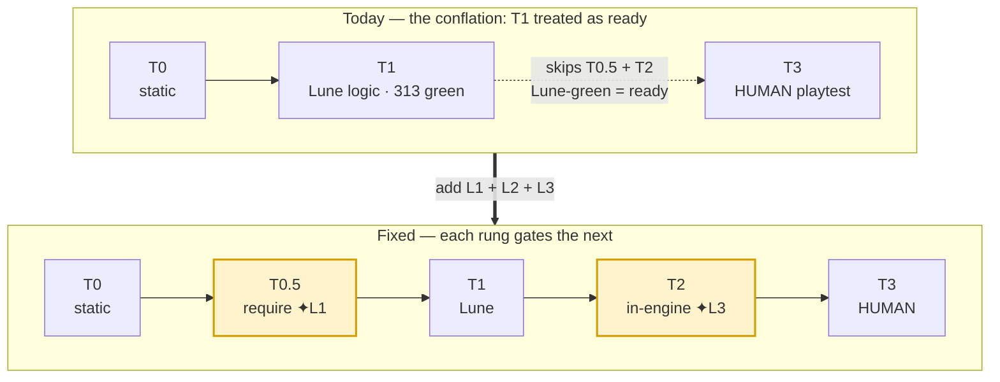
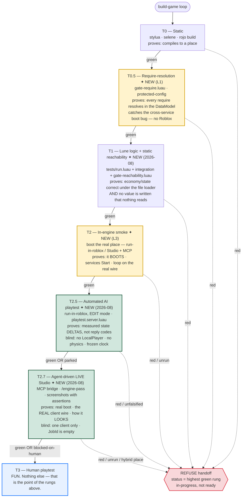

# VERIFICATION-LADDER.md — closing the gap between "green" and "boots"

Design note + implementation plan. It records *why the factory escalated a non-booting game to a
human*, names the root cause as a **conflation** (one bit standing in for "ready"), and specifies the
fix as three layers: a static require-resolution gate, an explicit gating ladder with an
"exhaust-automation-first" rule, and a Tier-2 in-engine smoke gate.

`FACTORY.md` owns *policy*; `LOOP-ENGINEERING.md` owns *why the loop is shaped this way + the upgrade
roadmap*; this file owns *the verification ladder* — the thing that decides when the loop is allowed
to reach the human. **`docs/AI-PLAYTEST-METHOD.md` owns the *method*** — what each rung is blind to,
which rung should catch which class of defect, and what is left for a person. Read the two together.
It extends `LOOP-ENGINEERING.md` §4 upgrades 3–4 (cross-turn grader + LLM-judge)
with the rung those upgrades assume but the factory does not yet have: **proof the game runs in
Roblox at all.**

Status: **L1 + L2 BUILT; L3 BUILT in park-mode (2026-06-30).** Originally a plan (2026-06-21); now
implemented. **L1** — `gate-require.luau`, the T0.5 gate, wired into the gauntlet (`0aa4d1e`). **L2** —
the handoff guard `.claude/skills/lib/tier-ladder.luau` (`highestTierReached` + `handoff`, unit-tested
in `.claude/skills/lib/tests/tier_ladder_spec.luau`) plus the **runnable aggregator**
`.claude/skills/lib/tier-status.luau` (`lune run …/tier-status.luau <gameDir>` → runs the gauntlet,
layers in any recorded T2 smoke, prints the honest handoff verdict), `integration-gate.js`'
`verificationTier` field, honest tier labels
in `FACTORY.md` §8 + `portfolio/README.md`, and the D1-shim-by-default authoring rule in
`core/CLAUDE.md`. **L3** — `.claude/workflows/smoke-gate.js`, the T2 in-engine smoke gate, in **park-mode**:
it prepares the lane (authors the smoke script + runbook) and returns `T2-blocked-on-human`, never
claiming `T2-green` without a real JSON evidence line; it activates when the Studio MCP bridge exposes a
run tool. Companion to the `tier1-tier2-require-blindspot` memory and `docs/TESTING.md` §9.

**2026-08 — the ladder grew three rungs (§6, §7, §8).** A human playtested `collect-sim` and an audit
confirmed **66 defects** behind a lane reporting all green. One pattern explained 26 of them and the
factory had no gate for it (**the root pattern** — see `docs/AI-PLAYTEST-METHOD.md` §1). The response
added: a **static reachability gate** inside T1 (`gate-reachability.luau`, gauntlet stage 5); **T2.5**,
an automated AI playtest in `run-in-roblox`'s edit-mode lane; and **T2.7**, an agent-driven **live
Studio** pass. `tier-ladder.luau`'s `RUNGS` now carries `T2.5` and `T2.7` with a **per-rung lane map**
(a single `engineLaneAvailable` boolean could not express "`run-in-roblox` is on PATH but Studio is
not"). **Read `docs/AI-PLAYTEST-METHOD.md` alongside this file** — it owns the *method* (what each rung
is blind to, and why), including an honest ledger of which of the new machinery has been observed RED
and which has not.

**Correction — the Studio MCP bridge is LIVE.** Two claims below (§2's "Studio MCP exposes zero tools"
and §5.2(a)'s caveat) were true when written and are now **false**. They are struck through in place
rather than deleted, because the reasoning that followed from them still explains why L3 shipped in
park-mode.

---

## 1. The problem — a conflation, not a missing test

The factory built `collect-sim`, ran it through **313/313 Lune tests, `rojo build`, `selene`,
`stylua`, maker≠checker gates, an adversarial review, and a convergence sweep** — every one green —
and handed it to the human for a playtest. The game **did not boot in Roblox at all.** A bare
cross-service `require("../../shared/…")` resolved under Lune's filesystem loader but threw at the
first require in the Roblox DataModel, killing the server before any service `Start`. (See
`tier1-tier2-require-blindspot`.)

That is not bad luck. It is structural:

**Every readiness signal in the loop bottoms out at one bit — `gauntlet.luau`'s `ok`.**

- `integration-gate.js` (~line 102) computes `green` from `coverage == 'pass' && author.gauntletOk`.
- `adversarial-review.js` returns `clean` from an agent *reading* code.
- `FACTORY.md` §8's "ready for human review" checklist is **prose no code computes**; the
  orchestrator asserts it.

All of them resolve to `gauntlet.luau`'s four stages (lines ~111–128): `stylua --check` · `selene` ·
`rojo build` · `lune run tests/run.luau`. What that bit actually proves is narrow:

> **formats + lints + compiles-to-a-place + logic passes under Lune.**

Two facts make the bit blind to boot:

1. **`rojo build` never runs a require.** It *serializes* `src/` into a `.rbxlx` place file. It
   proves the project compiles to a tree, not that any script in that tree loads.
2. **Lune always takes the `script == nil` branch.** Every cross-service module ships a dual-runtime
   shim: `if script == nil then <relative string require> else <instance require> end`. Under Lune
   `script == nil` is true, so the **Roblox instance-require branch — the branch that actually runs in
   production — is the dead branch no gate ever executes.** The real bootstrap
   (`src/server/init.server.luau`) is even tagged *"[Roblox-only — never required by a spec]"*; the
   integration suite re-implements a *"Lune-clean MIRROR"* of it instead of running it.

So the loop runs Tier-1 (Lune) and then escalates **straight to the Tier-3 human gate**, skipping the
Tier-2 in-engine truth entirely. The human became the fallback for machine work.

**The defect is the conflation:** `Lune-green` is treated as a synonym for `ready-for-human`. There is
no rung between Lune and a human, and **no rule forbidding escalation while a cheaper automatable check
is still un-run.** The decisive detail: the showstopper was **statically catchable with no Roblox at
all** — which is why the load-bearing fix is also the cheapest.

A compounding smell: the pervasive `Lune-clean: relative requires only` / `[D1 shim]` comments (40+
across `src`) read as correctness badges. They are the opposite — they mark a file that crosses a
service boundary and whose Roblox branch Lune never exercises. They lulled maker≠checker, adversarial
review, *and* convergence, all of which themselves run under Lune.

**The shape of the gap — today's escalation vs. the fix:**



---

## 2. The ladder — named rungs that each gate the next

Replace the single boolean with an **ordered ladder**. A rung only runs if the rung below is green.
The game's **status is the highest contiguous green rung** — never a bare "ready."



**Two rules the arrows encode.** A rung's *red* refuses the handoff regardless of the rung below it —
a recorded RED playtest is red even when T2 never ran (this was a real bug: the old `tier-status`
reader wrapped its T2.5 check in `if t2 == "green"`, so a recorded failure was silently ignored and
handoff still returned ready). And `T2.5-parked` is **not green** — it is the third verdict state that
exists so *"I found something broken"* and *"everything is fine"* can never again both be true of the
same run.

| Rung | What it runs | What it proves | Engine? | Built today? |
|---|---|---|---|---|
| **T0 — static** | `stylua --check` · `selene` · `rojo build` | Formats, lints, compiles to a place | No | ✅ (gauntlet stages 1–3) |
| **T0.5 — require-resolution** | `gate-require.luau` (new) | Every `require` resolves in the **DataModel**, not just the filesystem; D1 shim branches agree | No | ❌ **L1 below** |
| **T1 — Lune logic** | `lune run tests/run.luau` + integration suite | Economy/state logic is correct under the filesystem loader | No | ✅ (gauntlet stage 6) |
| **T1 — static reachability** ✦ | `gate-reachability.luau` | No value the player pays for is **written and read by nothing**; no dangling seam, unsunk currency, or unread replicated field | No | ✅ (gauntlet stage 5 — §6) |
| **T2 — in-engine smoke** | boot the real place; traverse the core loop | The game **boots**; services `Start`; loop completes over the real wire | **Yes** | ✅ (`run-in-roblox`) |
| **T2.5 — automated AI playtest** ✦ | `run-in-roblox` on `tests/tier2/playtest.server.luau` | Measured **state deltas** from real dispatches — the spec's promises, asserted as before/after | **Yes** (edit mode) | ✅ (§7) |
| **T2.7 — live Studio pass** ✦ | `/engine-pass <gameDir>` over the MCP bridge | Real boot · the **real client remote gateway** · screenshots with written assertions | **Yes** (Play + edit) | ✅ (§8) — *skill unrun, see §11* |
| **T3 — human playtest** | a person plays it | **Fun.** | Yes | ✅ (human gate) |

**Automatable today:** T0 → T0.5 → T1 → T2 → T2.5 (`run-in-roblox` is on PATH at
`~/.aftman/bin/run-in-roblox`; the lane is additionally gated on `GATE_ENGINE_LANE ∈ {1,true}` so a
machine without Studio installed parks honestly rather than failing noisily).
**Automatable with a live session:** T2.7 — needs Roblox Studio open on the place, `rojo serve` running
inside the game directory, and the MCP plugin connected. ~~Studio MCP exposes zero tools today~~ —
**stale.** `list_roblox_studios`, `set_active_studio`, `get_studio_state`, `execute_luau`,
`start_stop_play`, `get_console_output`, `screen_capture` and `wait_job_finished` are all live, and the
loop in §8 was driven end to end on them (commit `6b5dbee`).
**Human-only:** T3.

**Lane availability is per-rung, not one boolean.** `tier-ladder.luau` exposes `ENGINE_RUNGS =
{"T2","T2.5","T2.7"}` and a lane *map*, because "`run-in-roblox` is on PATH but no Studio session is
open" is the normal state of this machine and a single flag cannot say it.

This ladder makes the existing doctrine honest. `ARCHITECTURE.md` (tiers table, ~lines 152–160)
already *names* Tier-1 Lune / Tier-2 Open Cloud / Tier-3 Studio — but the loop never escalates through
them; it jumps T1 → T3. `docs/TESTING.md` §9 already says green means *"the logic is correct, which is
necessary but not sufficient."* The ladder turns that caveat into enforced control flow.

---

## 3. L1 — the static require-resolution gate (`gate-require.luau`)

**The single highest-leverage change.** Pure static analysis, no engine, no key, no Studio,
milliseconds to run — and it would have caught the exact showstopper that passed every existing gate
plus adversarial review plus convergence.

### 3.1 Idea

A new Lune script `.claude/skills/lib/gate-require.luau`, wired as a **fifth gauntlet stage after
`rojo build`** (so the project is known to compile) and **before the Lune stage** (so the boot class
fails fast and specifically). It reads `default.project.json` to build a filesystem→DataModel map,
resolves every `require` to a DataModel target, and **fails** when a string require crosses a
service-root boundary unless a `script == nil` shim's instance branch resolves to the **same** module.
It is the only gate that verifies the production (instance) require branch the other four are blind to.

### 3.2 The four require idioms it must distinguish

Grounded in the actual `collect-sim` code:

1. **String-literal relative** — `require("../../../shared/Net")`, `require("./Types")`,
   `require("./data/Store")`. Resolved against the source file's directory. The *only* idiom Lune runs.
2. **Instance expression rooted at `game:GetService(...)`** — `game:GetService("ReplicatedStorage")
   :WaitForChild("Shared").Net`, or via a `local Shared = …:WaitForChild("Shared")` binding then
   `(Shared :: any).Net`. The production path.
3. **Instance expression rooted at `script`** — `(script :: any).Parent.Result`.
4. **Dynamic / computed** — `require(someVar)`, concatenated paths. **Unresolvable → WARN, never a hard
   fail** (honesty: static cannot follow it).

### 3.3 Algorithm

1. **Scope** — glob `<gameDir>/src/**/*.luau`. Exclude `tests/`, `.verify_tmp/`,
   `.claude/worktrees/`, `.gauntlet-build.rbxlx`. Read `<gameDir>/default.project.json` via
   `@lune/fs` + `@lune/serde`.
2. **Mount table** — walk the project `tree`. Produce `{fsDir, dmPath, serviceRoot}` per `$path`
   mount. For `collect-sim` (and every game forked from `core/`, which is byte-identical except
   `name`): `src/shared → ReplicatedStorage.Shared` (root `ReplicatedStorage`); `src/server →
   ServerScriptService.Server` (root `ServerScriptService`); `src/client →
   StarterPlayer.StarterPlayerScripts.Client` (root `StarterPlayer`). **`serviceRoot` is the first
   DataModel segment — the boundary test compares these.**
3. **File → DataModel path** — for each file, find its mount (fsDir prefix), append the suffix
   segments. **Apply the init-collapse rule:** `init.luau` / `init.server.luau` / `init.client.luau`
   collapse into the *parent folder name* — `src/shared/init.luau → ReplicatedStorage.Shared` (not
   `.init`); `src/server/data/init.luau → ServerScriptService.Server.data`. Record each file's
   `container` (runtime visibility) from its serviceRoot: a **Server** script sees
   ServerScriptService + ReplicatedStorage; a **Client** script sees PlayerScripts + ReplicatedStorage
   but **not** ServerScriptService.
4. **Extract requires** — token-scan for `require(` + a balanced close-paren. Detect `if script == nil
   then` blocks and pair the then-branch (string) with the else-branch (instance) by assigned variable
   name or ordinal. Strip `(X :: any)` casts before classifying.
5. **Resolve string requires** — normalize against the source dir, **with the init quirk:** inside an
   `init.luau`, `./` resolves relative to the init dir's *parent*, so a sibling is `./<folder>/<Name>`
   (seen in `shared/init.luau`'s `./shared/Result` and `data/init.luau`'s `./data/Store`). Resolve
   `..`/`.`, append `.luau`, confirm the file exists, map back through the mount table to a DataModel
   path + serviceRoot.
6. **Boundary test (the core gate)** — compare `source.serviceRoot` vs `target.serviceRoot`:
   - **Match** (e.g. `Migrations.luau → ./Types`, both in ReplicatedStorage) → **PASS**, safe in both
     runtimes.
   - **Differ** → **cross-service**: works under Lune, throws in Roblox. **PASS only if** this require
     is the then-branch of a `script == nil` shim whose else-branch (step 7) resolves to the **same**
     target. Otherwise **FAIL** — a bare cross-service string require with no instance branch (the
     exact showstopper), or a shim whose branches drifted.
7. **Resolve + cross-check instance branches** — resolve the root token (`game:GetService("X") → X`;
   `script` → the file's own dmPath, `.Parent` walks up one segment), walk the `.Child` /
   `:WaitForChild("Child")` chain, confirm a ModuleScript exists there. For a D1 shim, **assert the
   instance target == the string target** (catches branch drift — the failure the shim itself can
   introduce, and the one no test covers because the instance branch never runs under Lune). Verify
   **container visibility**: a Client-container instance require must not target ServerScriptService.
8. **Comment-smell WARN (advisory)** — if a file carries `Lune-clean: relative requires only` /
   `[D1 shim]` *and* its cross-service require has no instance branch, WARN: *"misleading Lune-clean
   comment — names a Roblox-invisible path it does not actually exercise."* Advisory so a stale comment
   doesn't fail green code, but it surfaces the self-attestation that lulled the reviewers.
9. **Emit + wire** — emit the same `{name, ok, output}` Stage shape `gauntlet.luau` already consumes;
   insert one `runRequireGate()` entry into the `stages` table after the `rojo` entry. The existing
   `allOk = AND-of-stages` logic and every workflow that reads `{"ok": true}` inherit it with **zero
   call-site changes.**

### 3.4 What it catches / misses

**Catches:** the exact showstopper (bare cross-service string require, no instance branch); D1 shim
branch drift; client→ServerScriptService illegal reach; instance-require typos to non-existent
children; **and it protects every game forked from `core/`, not just `collect-sim`.** Encodes the
init-folder quirk so it doesn't false-positive on the two barrels.

**Misses (honest):** dynamic/computed requires (WARN only); WaitForChild races / replication timing;
**a module that resolves but errors at require-time** (throws in its top-level body — needs a real
boot); pure-instance Roblox-only files (`Context.luau`, the `init` entrypoints, `NetServer`,
`NetClient`) — it proves their requires are *reachable*, not that boot *succeeds*. Luau parser edge
cases (multiline requires, nested casts) — the token-scan is a heuristic; a real AST would harden it,
and it is the main correctness risk **in the gate itself.** This gate closes **one static class**; it
is not a substitute for T2.

### 3.5 Protected-config — **DECIDED: yes**

The gate that *defines* "green" must not be weakenable by the build agents it grades — that is the
maker≠checker discipline the factory exists to enforce. `gate-require.luau` ships as **protected-config**
(edited only via the human path, like the fence config per the resolved `fence-settings-gap`,
`54a6b33`). It lives next to `gauntlet.luau` under `.claude/skills/lib/` and is added to the same
protected set. **Note:** keep it a *gauntlet stage*, not a `.claude/hooks/` hook — as a `skills/lib`
helper it would normally be agent-editable; protected-config is applied here *deliberately* to lock it,
without dragging in the PostToolUse-hook machinery.

---

## 4. L2 — the explicit ladder + "exhaust-automation-first" rule

L1 closes the class; L2 closes the **conflation** so no future class slips through the same way.

### 4.1 The rule

> The loop **must not** emit `ready-for-playtest` / `awaiting-human-gate` until the **last automatable
> rung** is green **or explicitly blocked-on-human** — and the status label says which.

`lastAutomatableRung` = **T2** if the Studio/Open-Cloud lane is available, else **T1** with T2 recorded
as `blocked-on-human: Studio not connected`. If T0.5 is red or un-run, the loop returns
`in-progress (T0.x), NOT ready` and **refuses handoff** — it cannot reach the human.

### 4.2 Where it goes

- **A thin `build-game` aggregator** (the orchestrator `BUILD-GAME-DESIGN.md` §13 currently leaves to
  the human/main-session). Add `highestTierReached(results)` — walks T0 → T0.5 → T1 → T2 and returns
  the highest *contiguous* green rung — plus the handoff guard above. This is the code that finally
  enforces `FACTORY.md` §8's prose conjunction. **BUILT** as the pure policy
  `.claude/skills/lib/tier-ladder.luau` (`highestTierReached` + `handoff` + `statusFor`/`fromGauntlet`)
  and the runnable wrapper `.claude/skills/lib/tier-status.luau` (runs the gauntlet for a `<gameDir>`,
  layers in a recorded T2 smoke, prints the verdict, exit 0 iff `ready`). **Remaining:** auto-invoke
  `tier-status` inside the build-game handoff/FF step so the gate is mechanical end-to-end, not run by
  hand.
- **`integration-gate.js`** (~line 102/105) — the precise spot where Lune-green is laundered into
  `green`. Add a `verificationTier` field (`T1-green` | `T1-green,T2-unverified` | …) to the verdict
  and the return object, so no downstream reader can mistake Lune-green for engine-verified. Logic
  unchanged.
- **`portfolio/README.md`** funnel stages — split the single `verified-local` stage into honest
  labels: `verified-local-T1 (logic only, NOT engine-booted)` vs `engine-smoked-T2` vs
  `awaiting-human-gate-T3`. Relabel `collect-sim` from its hand-set `building` to its true tier.
- **`FACTORY.md` §8** (~lines 167–171) — rewrite *"the gauntlet is green"* to *"every automatable tier
  (T0..T2) is green or explicitly blocked-on-human, and the status label states the highest tier
  passed,"* so "ready for human review" can never again mean "T1-green."

### 4.3 Authoring-rule changes (builder defaults)

- **Make the D1 shim the default + required form for any cross-mount require** (shared↔server↔client).
  A bare relative string is permitted **only** for same-mount siblings. Codify in `core/CLAUDE.md` and
  the `new-game` scaffold's per-game `CLAUDE.md` so future builders inherit it rather than re-deriving a
  bare require.
- **Reclassify the `Lune-clean` comment from badge to audited risk-marker.** Add to
  `docs/LOOP-ENGINEERING.md` the rule: a `Lune-clean` / `[D1 shim]` attestation is evidence to
  **verify** the instance branch (T0.5 / T2), never to trust it. (The L1 WARN in §3.3 step 8 surfaces it
  mechanically.)

### 4.4 What it catches / misses

**Catches:** the conflation itself (no verdict can read "ready" off T1 anymore — status *is* the highest
contiguous green tier); premature escalation (refuses to hand a non-booting game to a human while T0.5
is red/un-run or T2 is runnable-but-un-run); the misleading-comment lull.

**Misses:** L2 enforces **order and honesty, not coverage.** If the T1 or T2 suites are themselves
shallow or tautological, a tier can be "green" while under-testing — the maker≠checker critics still
carry that load. L2 only guarantees the loop won't *conflate* a low tier for a high one.

---

## 5. L3 — the Tier-2 in-engine smoke gate

The rung that **executes the dead branch**: actually instantiate the DataModel, run the real
`init.server` → `Context.build()` → `Bootstrap.start` over the 13-service ordered list, and traverse
the core loop through the real `Net.dispatch` wire.

### 5.1 Smoke-script shape (emits one JSON line; fails **closed** if absent)

- **Phase 0 — boot-probe:** `pcall` the real bootstrap (`require(Server.Context)`,
  `Context.build()`, `Bootstrap.start(servicesInInitOrder, ctx)`). This single assertion executes the
  Roblox instance-require branch of **every** D1 shim plus `Context.build`'s pure-instance requires —
  catching the cross-service-require class at the *first* require. `Bootstrap.start` already wraps each
  `Start` and re-raises with the failing service name.
- **Phase 1 — wire-present:** assert the remotes created by `NetServer.Start` (Instance.new
  RemoteFunction/RemoteEvent) exist after boot and the registry contains the full `Net.Actions` set —
  proving every service registered its action on the **live** wire.
- **Phase 2 — core-loop traversal:** dispatch `collect.gather` → `collect.sell` → `shop.buy` →
  `daily.claim` through the real `Net.dispatch` pipeline (rate gate → ownership → validate → handler)
  with the real `ctx` (real `Clock.real(time)`, real `DataService`). Assert each returns `Result.ok`
  and the persisted view changed. This is `FACTORY.md` §8's *"core loop completable end-to-end"* checked
  **in-engine** rather than under a Lune mirror.
- **Phase 3 — assert-no-error / correct-rejection:** zero errors during boot+loop; rejections
  (malformed payload, over-rate, not-owner) return the expected `Err` code **over the real wire**
  (proves the `Result` envelope survives the real remote serialization boundary). Emit
  `{"tier":2,"ok":…,"phases":[…]}` as the final line; `ok` = AND of phases. Missing line = FAIL (same
  fail-closed hardening `gauntlet.luau`'s `runLune` already uses — a run that crashes before printing
  must read as FAIL, never silent pass).

Wire it as a **separate** `.claude/workflows/smoke-gate.js` step run *after* the gauntlet (the gauntlet
stays the cheap static+T1 mirror), returning `{verdict: 'T2-green' | 'T2-red' | 'T2-blocked-on-human',
evidence}`.

### 5.2 Driving it — the realistic autonomy ceiling

Three options against the **hard publish fence**:

- **(a) Studio + Roblox Studio MCP — RECOMMENDED.** The only option that runs a real DataModel while
  staying cleanly inside the fence. The human opens the `rojo`-built place once with the MCP plugin
  live; thereafter the factory injects the smoke script and reads the JSON verdict. **Fence-clean by
  construction:** zero network calls, no `rbxcloud`/`lune publish`/curl-to-roblox, no
  publish/account/money. The **one** human action is: open the place in Studio with the plugin
  connected. ~~*Caveat:* the registered `Roblox_Studio` bridge currently exposes **zero tools** — until
  the plugin is live, the factory can only **prepare** the lane and hand a runbook.~~ **STALE as of
  2026-08:** the bridge is live and was driven end to end — see §8. The plugin's Connect button is not
  even required: `rojo serve`'s read API lets Studio fetch the tree itself (§8, STEP 1).
- **(b) Open Cloud Luau Execution — INSIDE the fence, rejected for autonomous use.** Blocked as
  *code* today, not just policy: `Fence.luau` blocks every net call whose host matches the `roblox.com`
  suffix (and `apis.roblox.com` is where Luau Execution lives) and blocks `rbxcloud` outright. The fence
  is **host-based, not operation-based** — a read-only sandbox execution is blocked identically to a
  publish. It also needs an Open Cloud key (a credential action) **and** a place that already exists
  Roblox-side (a prior publish). Enabling it is an explicit human-only future decision (provision key +
  narrowly allowlist an execute-only endpoint in both fence layers).
- **(c) Local headless (`run-in-roblox`)** — fence-clean if added, but not present in the repo and still
  needs Studio installed. The right thing to add later for true unattended CI; not now.

### 5.3 Degrade honestly

If the MCP bridge exposes no run tool: write the smoke script to a known path + a one-paragraph runbook
(*"open `.tier2.rbxlx`, paste this into the command bar, paste the JSON back"*) and **park** the game at
`awaiting-engine-smoke`. **Never claim T2-green without the JSON line.** Until that one human action
happens, the honest label is `verified-local-T1 (logic only) — NOT engine-verified`.

### 5.4 What it catches / misses

**Catches:** run-only classes static can't reach — a `Start()` that throws, WaitForChild infinite-yield,
the real scheduler (the **dead auto-collect ticker** that nothing on Heartbeat drives), Players
lifecycle, real remote serialization, the real `Clock` mono source, boot-order races, and requires that
resolve but error at require-time.

**Misses:** Studio is not truly headless (semi-auto, not unattended CI). Does **not** fix the
persistence class — the runtime store is still in-memory `MockStore`, so receipt-double-grant-on-restart,
real DataStore quota/throttle, and cross-server SessionLock contention need **B2's `SessionStore` built
first**. No presentation (loop driven via `Net.dispatch` with a synthetic player, not real input/
SpawnLocation). Single-server only — multi-client replication races and live exploit traffic stay T3.

---

## 6. The T1 static-reachability gate (`gate-reachability.luau`)

**Built 2026-08, wired as gauntlet stage 5** — after `require`, before `lune`, because it is the
cheapest gate that can see the root pattern and it should fail fast and specifically. Verified stage
list: `stylua · selene · rojo · require · reachability · lune`.

### 6.1 Why it belongs to T1, not a new rung

A reachability failure means the game's *logic* is inert — which is exactly what T1 claims to certify.
T0.5's label is specifically require-resolution, and adding a rung reopens the `RUNGS` contract that
`tier_ladder_spec` asserts on. So T1 is `statusOf({"lune", "reachability"})` — both stages must be
green.

### 6.2 The eight rules

Each anchors its subject discovery on a **core-owned location** (present the moment a game is
scaffolded), never a per-game name — a per-game subject manifest was rejected, because the defect class
is "a value was added and never wired" and a manifest asks the same agent, in the same turn, from the
same misunderstanding, to declare the thing they just forgot to wire. **An empty manifest scores 100%.**

| rule | subject discovery | catches |
|---|---|---|
| `seam-read` | `context.<field> = <Ident>` inside a `Start(context)` body, then every `function <Ident>.<method>` | a tuning curve read only by the file that defines it — `CAPACITY = 50` beside a persisted backpack level |
| `seam-installed` | a seam-shaped table with no `context.<field> =` install site | a seam defined and never wired to `ctx` |
| `catalog-id-read` | keys of a `local CATALOG` table literal + `upgrades["<id>"]` string literals | the four inert upgrades — each id appeared exactly twice, once in the catalog and once in a validator, never in a rule |
| `currency-sink` | keys of `currencies = {…}` in `Migrations.default` | Prisms: granted, persisted, shown in the HUD, decremented by nothing |
| `view-field-read` | `Types.toView`'s projected fields, **recursed one level** into `PlayerData` | `boostExpiresUnix` / `lastClaimUnix` / `resetsAtUnix` / `dayNumber` replicated to nobody |
| `banned-player-type` | `type(player) == "table"` | the empty leaderboard in every live server, forever, green in every test |
| `legacy-globals` | statement-boundary `wait`/`spawn`/`delay` | **defence-in-depth only — duplicates selene.** Its greenness is not coverage |
| `presentation-floor` | `leaderstats` · `Lighting` · `Sound` · Tween | **WARN-only** — see 6.4 |

The one-level recursion in `view-field-read` is **mandatory, not optional**: all five fields
`Types.toView` projects are **wholesale-copied tables**, so a naive rule checks five table names and
calls itself complete while `stats.lifetimeStardust` rides along invisibly.

### 6.3 Non-vacuity by construction — there are no thresholds to relax

Deliberately **no numeric constants** (`server > 10`, `checked >= 8` and friends were deleted: they
were one game's current *size*, and their failure path is being relaxed to `> 0`, which is vacuity
wearing a counter). Instead:

- **Presence:** at least one `.luau` under each mount `default.project.json` declares. Zero mounts →
  FAIL.
- **Maturity carve-out:** below `gate-sample.detect(gameDir).hasRealFeatures`, rules R1–R5 report a
  **third state, `not-applicable`** — tallied separately, never counted as a pass. A fresh scaffold must
  pass, or `new-game` is broken for every future game.
- **At or above maturity, zero subjects is a hard FAIL:** *"discovery found no `<subjects>`: either the
  convention drifted or this gate is now blind."*
- **Monotonic baseline** (`tests/tier0/reachability-baseline.json`): a *drop* in subject count without
  a live waiver is a FAIL. 16 seams → 2 is the same lie as zero. An absent baseline is a WARN plus the
  command to write one, never a FAIL. `M.run` never writes anything.
- **Every subject count is printed numerically** on line 1, so a coverage collapse is visible to a
  reader skimming one line.

### 6.4 Waivers, and why `presentation-floor` is only a WARN

Per-game exemptions live in `<gameDir>/tests/verification-allow.json`, keyed `file::Table.method` —
**bare method names are rejected**, because keying by bare name meant exempting `tuningFor` exempted
*every* `tuningFor` in the game. Every entry needs a dated `expiresUnix` (missing/expired → the entry is
invalid → **fail the rule it names**; `> 30 days` → FAIL; **matched nothing this run → FAIL**), and
every active waiver is echoed into the gate output *and* the evidence JSON. A waiver is never invisible.
The defeat-blocker: `playtest-pass.js` refuses green if `git status --porcelain` on that file is dirty —
an agent cannot trip a RED and waive it in the same turn.

`presentation-floor` is **WARN-only, in its own output section**, for a reason worth writing down: **a
presence check is satisfied by the code that DELETES the thing.** `Ambience.apply` *removes* `Sky` and
`Atmosphere`, and the substring `child:IsA("Sky")` satisfies a presence assertion perfectly. It proves a
token is in the tree; it never proves the token reaches a player. Making it FAIL factory-wide would
block every build on the rule most likely to degrade into token-stuffing.

### 6.5 What it catches / misses — measured, not claimed

**Proven RED** (§11 has the full ledger): four independent ways of aiming the gate at nothing — emptied
catalog, `src/` moved away, deleted `default.project.json`, non-existent `gameDir` — all go red, two of
them via two mechanisms at once. Orphaning a **uniquely-named** seam method goes red with exact
`file:line` and a copy-pasteable waiver subject.

**Measured misses — do not treat these as covered:**

- **R4 `currency-sink` is file-level, not currency-level.** Removing the game's only Prism purchase —
  the literal Prisms defect, restored — stayed **GREEN**, because a file that merely *mentions* Prisms
  in a read-only balance echo and separately spends *Stardust* satisfies the sink test.
- **R1 `seam-read` matches a bare method name across files.** Three seams publish `multiplierFor`; any
  one being live marks all three read.
- **R3 `catalog-id-read` counts display code as a read.** One surviving `elseif upgradeId == "magnet"`
  inside a shop label-preview kept a fully inert upgrade green.
- **The stage boolean has only two states.** `not-applicable` is honest in the prose and in `counts`,
  but the stage returns `ok = true`, so an immature game reads green to any machine.

---

## 7. T2.5 — the automated AI playtest (`run-in-roblox`, edit mode)

`.claude/skills/lib/templates/tier2/playtest.server.luau` + `AUTHORING.md`, forked into
`<gameDir>/tests/tier2/`, driven by `.claude/workflows/playtest-pass.js`.

### 7.1 The inversion: a phase body returns nothing

In the predecessor a phase was `function(): (boolean, any)` — **the author computed green themselves**,
and every vacuity defect in the corpus is an author returning `true` having observed nothing. So the
body now returns **nothing at all** and the harness derives the result from probe state:

```
phase.ok = (failedAssertions == 0) and (#unmeasurable == 0)
           and (subjectsDeclared >= minSubjects)
           and (deltas >= 1 or spec.deltasRequired == false)
```

`probe:delta(label, read, act, expect)` — **the harness calls `read()` on both sides**, so the author
cannot snapshot themselves and re-read the value they just wrote from the same buffer. `probe:expect`
is a shape check and explicitly **cannot** satisfy the delta requirement. `probe:unmeasurable(label,
why)` is the *only* channel for "I could not check this" and it **disqualifies green** — replacing three
forbidden shapes that shipped: `"NOT a defect"` in a pass string, and `bootstrapParity = "UNCHECKED"`
in two scripts.

### 7.2 Three verdict states — the whole point

```
red    any gating phase not ok · roster mirror ≠ phases.json (two-sided) · bootstrap mirror
       unreadable or still nil · a blindTo cites a limit measured as LIFTED · an expired /
       over-30-day / matched-nothing waiver
parked all gating pass, but a non-gating phase failed · any unverified entry · any phase
       still named "example-"
green  otherwise.   ok == (verdict == "green"), always. A mismatch is malformed → red.
```

The third state exists because the old lane published `"ok": true` on a build where all four shop
upgrades did nothing, every island was freely walkable, and rebirth cut income 93% — while the
assertion that *found* it (`capacityBefore: 50, capacityAfter: 50`) sat in a sibling field contributing
nothing to the verdict. A second reporting channel cannot fix that. Only a third verdict state can.

### 7.3 The lane's measured limits, re-measured every run and **inverted**

`serverClockAdvances = false` · `physicsSteps = false` · `hasLocalPlayer = false`, plus `game.JobId ==
""`. The `lane-limits` phase goes **RED when a limit LIFTS** — a release that starts stepping physics is
an invitation to build rungs currently declared impossible and must interrupt a human rather than pass
quietly. **Comments rot; assertions do not.** A phase declaring `requiresLimit` on a limit measured as
absent is *refused and recorded unmeasurable*, never run — which is how the deleted pacing rung
(30 successes / 290 rate-shed of 320 dispatches: **exactly the burst size**, because a frozen clock
never refills the bucket) became a mechanism instead of a judgement call.

### 7.4 The evidence contract

One line, **last**, prefixed `##T25-EVIDENCE## ` — because `HttpService:JSONEncode` key order is
unspecified and the previously documented recipe (`grep -E '^\{"ok"' | tail -1 > …`) was **broken three
ways**: the artifact begins `{"verdict"`, the pipeline's exit status is `tail`'s (always 0, so a total
failure looked like success), and `>` truncates the last good artifact before you know the run produced
any. The committed `.json` is sentinel-free. The roster lives in a committed `phases.json` for readers
*and* as an inline mirror the harness emits, because **a `run-in-roblox` standalone script cannot read
the filesystem** — the ingest does the two-sided set-diff.

### 7.5 Falsification is required, not suggested

`playtest-pass.js` returns **`T2.5-unfalsified`** unless `last-falsification.json` records an observed
RED for **every** gating phase, produced against the **same `scriptSha256`** as the harness on disk (a
proof against a since-edited harness proves nothing), with `reverted: true`. Staleness is a live problem
here, not a theoretical one: commit `8aa53ce` exists solely because a green artifact predated the fix it
claimed to verify and **every reader accepted it.**

### 7.6 Measured limits of the harness itself — read this before trusting a T2.5-green

**Nine of eleven adversarial attacks produced a green or unreported verdict.** A five-phase all-gating
roster reported `verdict: "green", ok: true` while touching the game nowhere, asserting the **root
pattern itself**, claiming 999 subjects and checking one, and asserting `"unchanged"` about a balance
that changed by −75. The structural diagnosis: *the harness took the verdict away from the author and
left them the subject* — `probe:delta` mandates that **a** read happen, never asks **what** was read.
Ranked open work in `docs/AI-PLAYTEST-METHOD.md` §8; the P0 is that `probe.delta` projects `expect.field`
**after** `act()` runs, so a live-table read (`ctx.data:get(player)`, the dominant idiom here) makes
`direction = "unchanged"` an unconditional pass.

---

## 8. T2.7 — the agent-driven live Studio pass (`/engine-pass`)

`.claude/skills/engine-pass/SKILL.md`. Evidence under `<gameDir>/tests/engine-pass/`.

**Deliberately not T3.** `RUNGS` reserves T3 for the *human* playtest (`automatable = false`), and an
agent driving Studio still cannot see fun, cannot contend two clients, and `game.JobId` is `""`.
`tests/tier3/` stays reserved and unused.

**The ten steps, each fail-closed.** Session selection (zero Studios listed → the pass is **UNRUN**,
never "assume it is fine") · **Rojo self-sync over HTTP** — `HttpService.HttpEnabled = true`, `GET
/api/rojo` → `rootInstanceId`, `GET /api/read/<id>` → a flat instance map carrying
`Properties.Source.String`; ~46 scripts in about a second, and **no human presses Connect** · provenance
(any `mismatchCount > 0` ⇒ `T2.7-hybrid-place`, **cannot be green** — the factory's best in-engine proof
had to ship with exactly that caveat) · **name-shadow detection, rename-never-delete** (a `Shared`
*Folder* from another project shadowed the game's `Shared` *ModuleScript* and `require` resolved to the
wrong instance) · boot + console **where an empty console is a FAILURE** (each probe declares the lines
that must APPEAR; the JoinRetry fix prints `[JoinRetry]` *specifically so green is observable*, because
a working fix and a missing fix otherwise produce an identical empty console) · a server-authority delta
probe · **driving the real `RemoteFunction` from the CLIENT context — the only rung that can see client
wiring at all** · an edit-mode world build for a controlled camera · the measured-gotcha register · **the
screenshot protocol** · the evidence artifact.

**The screenshot protocol is the part that is easiest to get wrong.** State the assertion *before*
capturing; record `pass` / `fail` / **`cannot-tell`**; `cannot-tell` is **not a pass**; an image with no
assertion string is dropped and pushes its phase red. Three of the five defects this loop found were
invisible in every log — the blank-texture `Sky` rendering no stars, the 110-stud `AlwaysOnTop`
billboards, and `22 total, 0 visible, 22 parked`. **The correct sky config was a deletion, and the
version with more code in it looked worse. Screenshots decided that; reasoning did not.**
(`docs/AI-PLAYTEST-METHOD.md` §3.)

**Do not reuse T2.5's lane measurements here.** The frozen clock / no-physics / no-LocalPlayer limits are
properties of the `run-in-roblox` **edit** lane, measured there. Anything claimed about Play mode must be
measured in Play mode and appended to `<gameDir>/tests/engine-pass/ENGINE-FACTS.md` with the experiment
that produced it.

**Status: the loop is proven, the skill is UNPROVEN.** The sync/probe/screenshot loop was driven end to
end and produced five real fixes (`6b5dbee`). The *skill* has never been executed — no
`games/collect-sim/tests/engine-pass/` directory exists. What would prove it: `/engine-pass
games/collect-sim` against a live Studio, **plus** the mandatory falsification run (rename one mounted
script in the place first; the pass must report `T2.7-unrun (hybrid or unverified place)` and **must not
proceed to screenshots**).

---

## 9. Honest limits + what stays human

Even with all six automatable rungs, classes remain below them:

- **Persistence / restart** (receipt re-grant, DataStore quota, cross-server locks) — B2's
  `SessionStore` is built and verified against real storage, but **JobId uniqueness and cross-server
  exclusion still need live players**: `game.JobId` is `""` in Studio, in Play mode, and under
  `run-in-roblox`, so cross-server exclusion is untestable **by construction** on every rung below T3.
- **Semantic cross-service drift** that isn't a require error — e.g. `RestockService`'s hard-mirrored
  `ISLAND_IDS = {1..5}` going stale when the islands catalog grows. Resolves fine (invisible to T0.5),
  each unit test internally consistent. Needs a separate **cross-service-constant invariant** check.
  *(Partially addressed: `gate-reachability`'s `catalog-id-read` sees an id nothing reads, but not two
  catalogs that have drifted apart.)*
- **Dead-but-valid wiring** — `tickAutoCollect` exposed but driven from no Heartbeat. T0.5 sees a valid
  module; T1 calls the ticker directly and passes. **Now partly caught:** `seam-read` fails a seam
  method no other file references, and T2/T2.5 surface it as a behavioural absence.
- **Whether a gap is jumpable.** Physics does not step in the `run-in-roblox` lane, so `traversal` is a
  raycast proxy. T2.7 in Play mode and T3 are the only rungs that can answer it.
- **The rungs' own blind spots**, which are the useful list — see `docs/AI-PLAYTEST-METHOD.md` §2.

**Legitimately human (never automated, by design — `FACTORY.md` §5): FUN, first and foremost** — that is
what the six rungs beneath it exist to protect. Plus presentation & aesthetic judgement (T2.7 can prove
the stars render; it cannot prefer them); real input / world interaction; multi-client replication &
live exploits; asset trust; and the fenced **publish / `git push`** (`FACTORY-LOOP.md` §4 invariant 2:
the only path to Publish runs through the human gate). The ladder changes **when** the loop may reach
that human, and **what he spends the first minute on** — not who pushes.

---

## 10. Recommended sequence + how it slots into the roadmap

1. **L1 — `gate-require.luau`** (protected-config). Lowest cost (~250–350 lines reusing `fs`+`serde`
   already in `gauntlet.luau`, one line to wire), fully autonomous, fence-clean. **Catches the class
   that shipped, and can statically verify the current boot fix on `fix/tier2-roblox-boot` — all ~14 D1
   shims resolving both branches to the same module — with no Studio.** Build first.
2. **L2 — ladder + exhaust-automation-first rule + honest labels + authoring rules.** Surgical edits to
   the aggregator, `integration-gate.js`, `FACTORY.md` §8, `portfolio/README.md`, `core/CLAUDE.md` and
   the scaffold. No new infra. Build second.
3. **L3 — `smoke-gate.js` in park-mode now**, activating when the Studio MCP bridge is live (or an Open
   Cloud carve-out is human-provisioned). Wiring + runbook ship now; the run activates on the one human
   action.
4. **Authoring hardening alongside** — D1-shim-by-default + comment-smell audit travel with L2.

This is the missing rung beneath `LOOP-ENGINEERING.md` §4 upgrades 3 (`/goal` cross-turn grader) and 4
(LLM-judge): a fresh-model grader and a quality judge are only as honest as the tiers they grade. L1+L2
make the graded condition mean *"boots and the loop is reachable,"* not *"passes under Lune."*

---

## 11. Status ledger — what has been observed RED, and what has not

Doctrine: **a gate never observed RED is not known to work.** This section is the record, not the plan.
Every row was produced by an actual run. The full narrative is in `docs/AI-PLAYTEST-METHOD.md` §7–§8.

| Rung / machinery | Built | Observed RED | Honest status |
|---|---|---|---|
| T0, T0.5, T1 (Lune) | ✅ | ✅ | in production since `0aa4d1e` |
| **T1 reachability — vacuity defence** | ✅ | ✅ **four independent ways** (empty catalog, `src/` removed, no `default.project.json`, missing `gameDir`) | strongest single result in the build |
| T1 reachability — `seam-read`, unique name | ✅ | ✅ | works |
| T1 reachability — `seam-read`, **colliding** method name | ✅ | ❌ **GREEN on a real orphan** | rule matches a bare method name; needs `Ident.method` |
| T1 reachability — `catalog-id-read` | ✅ | ⚠️ only in strengthened form | one display-only `elseif` kept an inert upgrade green |
| T1 reachability — `currency-sink` | ✅ | ⚠️ only in strengthened form | sink test is file-level, not currency-level |
| T2 boot smoke | ✅ | ✅ | `last-smoke.json` present |
| **T2.5 harness** | ✅ | ⚠️ **2 of 11 attacks** | see §7.6 — the *shape* of the verdict is fixed; green-by-vacuity is not closed |
| `playtest-pass.js` | ✅ | ❌ **never executed** | run its §C.8 acceptance cases, especially test 3 |
| **T2.7 loop** | ✅ | ✅ (found 5 defects, `6b5dbee`) | proven ad hoc |
| **T2.7 skill** (`/engine-pass`) | ✅ | ❌ **never executed** | no `tests/engine-pass/` artifacts exist anywhere |
| `games/collect-sim` at T1 | — | — | **RED right now:** `tier-status.luau` reports `highest=T0.5 \| in-progress (T1 red), NOT ready` (6 reachability FAIL, no allowlist) |

**The one blocker needing a human decision.** `gate-reachability` is red on the untouched
`games/collect-sim`, and since it is a gauntlet stage, so is that game's gauntlet. All six findings are
**true positives against the rule as written** (verified by grep). But `walkSpeedFor` *is* read — by
`humanoid.WalkSpeed = UpgradesSeam:walkSpeedFor(d)` two lines below, **in the same file** — and R1's
contract is cross-*file*. So single-file-consumed seams would need a waiver renewed forever, and
**30-day waivers renewed forever are exactly how allowlists rot into blanket suppression.** Either
author `games/collect-sim/tests/verification-allow.json`, or narrow R1. Not an agent's call.

---

## 12. Decisions + open questions

**Decided:**

- **L1 ships as protected-config** (§3.5) — the gate that defines "green" is not editable by the agents
  it grades. *(Adding `gate-require.luau` + `gauntlet.luau` to `PROTECTED_FENCE_FILES` remains the one
  human-only follow-up; `tier-ladder.luau` and now `gate-reachability.luau` should join them when that
  lands — the handoff verdict must not be agent-editable either.)*
- ~~**Plan first, build later**~~ — **done: L1 + L2 are built, L3 is built in park-mode** (see the status
  block at the top). This document is now both the design rationale and the record of what shipped.
- ~~**L3 activation: stand up the Studio MCP bridge now, or activate later?**~~ — **done. The bridge is
  live and driven** (§8). `run-in-roblox` is on PATH, so T2 and T2.5 run unattended too.
- **The live-Studio pass is `T2.7`, not `T3`.** `RUNGS` reserves T3 for a human; an agent driving Studio
  is not a human playtest. `tests/tier3/` stays reserved and unused.
- **Per-game waiver allowlists** (`<gameDir>/tests/verification-allow.json`) rather than a protected
  factory-level file — exemptions must be reviewable beside the game — **plus** a mechanical
  defeat-blocker: a waiver added in the same turn as the RED makes the lane red.

**Open (for a future build pass):**

- **The T2.5 P0 fixes** (§7.6 / `AI-PLAYTEST-METHOD.md` §8) — the aliased-read bug, the name-keyed
  structural exemption, and the game-contact instrument. Until they land, a `T2.5-green` means *the
  measurements that were taken passed*, not *the game works*.
- **The three `gate-reachability` rule defects** in §6.5.
- **`not-applicable` as a third stage state.** Today an immature game returns a green stage boolean.
- **Open Cloud carve-out:** leave fenced (default), or design a narrow execute-only allowlist as a
  separate human-owned decision?
- **Tier labels:** raw `T0..T3`, or friendlier names in the portfolio funnel?
- **Adjacent lints:** the cross-service-constant invariant check is still unbuilt.
