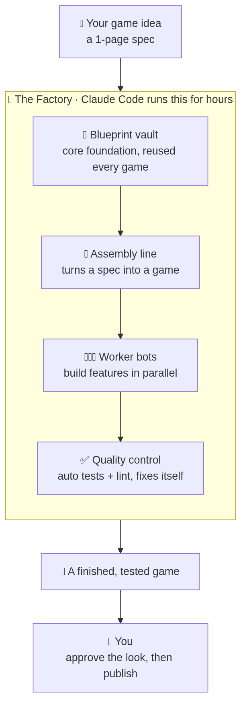
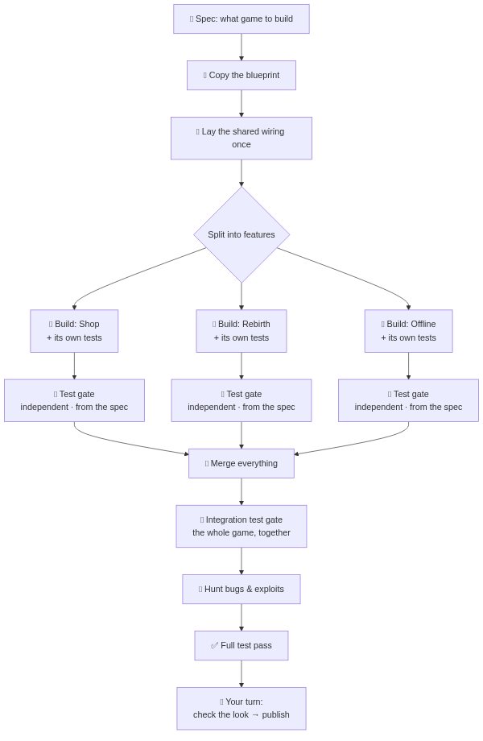
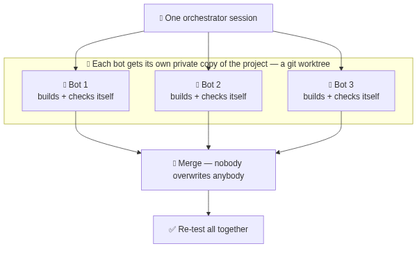
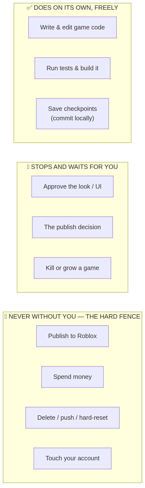
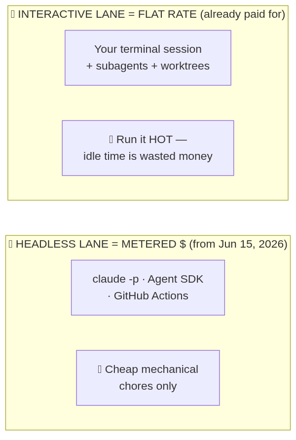

# The factory, explained like a human 🏭

> `FACTORY.md` and `ARCHITECTURE.md` are written for precision. **This file is written for you** —
> plain words, pictures, and a simple analogy. If the other docs ever feel like a wall of jargon,
> come back here.

## The one-sentence version

> **You describe a game in one page. Claude Code builds it for you — for hours, on its own,
> checking its own work — and only taps you on the shoulder for the few decisions a human has to make.**

And because it's a *factory*, the same machine makes game after game, not just one.

---

## The big picture 🖼️

Think of a real factory. Raw idea goes in one door; a finished, boxed product comes out the other.
Inside there's a blueprint vault, an assembly line, worker robots, and a quality-control station.
Ours is exactly that — except the "robots" are Claude Code agents and the "product" is a Roblox game.

**In plain words:** you hand the factory a short description of a game. Inside, it grabs a reusable
blueprint, runs it down an assembly line where robots build the pieces and a quality station checks
them, and out comes a finished, tested game. Then *you* — the human — give it a look and decide to
publish.

---

## How a game actually gets made ⚙️

This is the assembly line in detail. The clever bit is the middle: instead of one robot building the
whole game slowly, the work is **split into features** and many robots build them **at the same time**.

**In plain words, step by step:**
1. **Spec** — your one-page description (e.g. `specs/collect-sim.md`).
2. **Copy the blueprint** — start a new game from the shared foundation, so we never start from zero.
3. **Lay the shared wiring once** — set up the few things every feature touches, *before* the robots
   start, so they don't trip over each other.
4. **Split into features** — shop, rebirth, offline earnings… each robot builds its piece **and writes tests for it**.
5. **🧪 Test gate (per feature)** — a *separate* testing robot writes **fresh tests from your spec** and runs everything. The feature isn't allowed to merge until it's green.
6. **Merge everything** — combine all the robots' work, keeping every piece.
7. **🧪 Test gate (after merge)** — the testing robot tests the **whole combined game** — features working together, and nothing that worked before is broken.
8. **Hunt bugs & exploits** — other robots try to *break* the game (especially cheating), and fix what they find.
9. **Full test pass** — the whole game must pass every automated check.
10. **Your turn** — you check how it looks and feels, then make the publish call.

> **Why test at every step?** The robot that built a feature is biased toward its own work. A
> *separate* tester, writing tests from **your spec** instead of from the code, catches the bugs the
> builder can't see — so problems are caught at the smallest possible scope, before they pile up.

---

## How robots work in parallel without stepping on each other 🤖

The scary-sounding part ("worktrees", "subagents") is really simple: **give each robot its own private
copy of the project.** They can't overwrite each other because they're not even in the same room.
When they're done, their work is merged back together carefully.

**In plain words:** one "manager" session hands each robot a private copy of the project (that copy is
called a *worktree*). Each robot builds its feature and checks its own work. Then everything is merged
back so nobody's work gets lost — and the combined result is re-tested.

This is why your Max-20x subscription matters: you're paying a flat price to run **many robots at once**,
for hours. Leaving them idle would be wasting money you already spent.

---

## What it does on its own — and where it stops for you 🚦

You said: *"I don't want to babysit."* So the factory is built to run freely **inside a fence**. Green =
it just does it. Yellow = it stops and waits for you. Red = it can **never** do this on its own, ever.

**In plain words:**
- **Green (does it freely):** writing code, running tests, saving its progress. The boring, safe,
  reversible stuff. No nagging you for permission.
- **Yellow (waits for you):** anything that needs human taste or a real decision — *does it look good?*,
  *should we publish?*, *is this game worth growing or should we kill it?*
- **Red (never alone):** publishing to Roblox, spending money, deleting things or undoing history,
  or touching your account. These are locked at the tool level — even if a robot "wanted" to, it can't.

Safety net: it saves a checkpoint after every step, and your folder is backed up by OneDrive, so
nothing is ever truly lost.

---

## Why we run it a certain way (the money part) 💸

Anthropic changed billing on **June 15, 2026**. The short version: keeping a normal session open and
busy is **already paid for** (flat rate). But fully "robot, go do this while I sleep" background runs
get **metered** (cost real money per use). So we keep the *thinking* in the free lane.

**In plain words:** we run the brains of the operation in the lane that's included in your subscription,
and only use the pay-per-use lane for tiny mechanical chores (like the final "upload" button later).
Net effect: you can run it hard for hours and it stays on the flat price you already pay.

---

## Who does what — you vs. the factory

| The factory does (on its own) | You do (the human) |
|---|---|
| Write all the game code | Confirm the game idea / theme |
| Build the systems & economy | Approve how it looks & feels |
| Run every automated test, fix its own bugs | Decide to publish (and the ~30 min of Roblox steps with no API) |
| Hunt cheats/exploits and patch them | Decide to grow a hit or kill a flop |
| Save progress, write status notes | Set up the Group + publishing key (one time) |

---

## Where we are right now 📍

- ✅ **The factory's rulebook and structure are written** (this is "Phase A").
- ⬜ **Next: build the actual machine** — the reusable foundation + the assembly line + the safety guard
  ("Phase B").
- ⬜ **Then: make the first game** — the Collect Simulator — to prove the whole thing works ("Phase C").

You're currently reviewing Phase A. When you're happy, say **"go"** and I build Phase B.

---

## Scary words, in plain English 📖

- **Luau** — the programming language Roblox uses (a flavour of Lua). It's just "the language the game is written in."
- **Rojo** — a tool that turns code files on your computer into a real Roblox place. "The thing that assembles the game."
- **Worktree** — a private copy of the project for one robot, so parallel robots don't clash.
- **Subagent / agent** — one Claude worker doing one job.
- **Orchestrator** — the "manager" session that hands out jobs and merges the results.
- **The gauntlet** — the set of automatic checks code must pass (format → lint → build → tests). "Quality control."
- **Server-authoritative** — the game's brain lives on the server, not the player's device, so cheaters can't just edit their screen to win.
- **Open Cloud** — Roblox's official way for programs to publish/update games. (We keep this in the locked-red zone.)
- **The fence** — the hard list of things the factory can never do without you.
- **Spec** — your one-page description of a game; the factory's input.
- **core / games / Foundry** — the reusable blueprint / the actual games / the factory brain.
